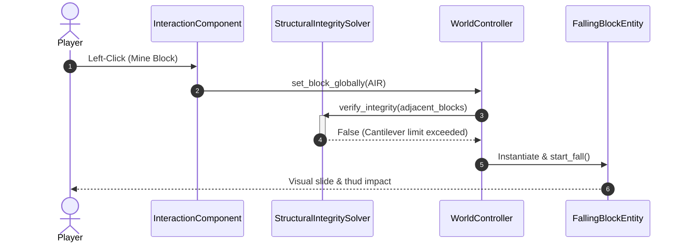
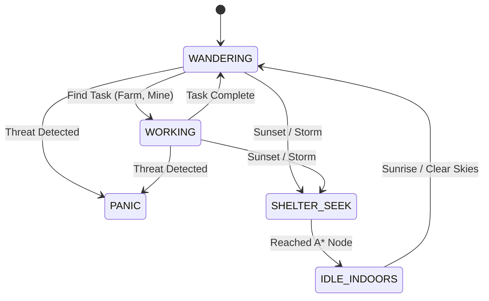
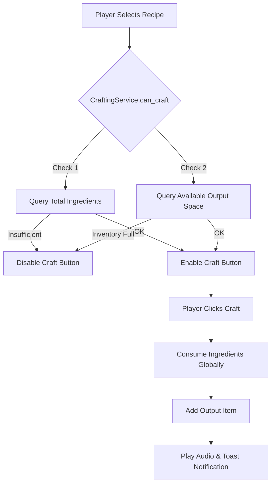

# CraftDomain - System Mechanics & Survival Manual
*Written by Enrique González Gutiérrez (enrique.gonzalez.gutierrez@gmail.com)*

Welcome to **CraftDomain**, a high-performance, infinite procedural voxel sandbox engine. This manual is a comprehensive, system-level documentation designed to help you navigate, mine, build, fight, trade, and craft within the simulation. 

The game is engineered to sustain a locked **120 FPS** performance profile. Every gameplay mechanic described below is backed by strictly decoupled **Domain-Driven Design (DDD)** architectures.

---

## 🌐 1. Multiplayer Lobby & Network Protocols

CraftDomain features a zero-configuration P2P Multiplayer system leveraging UPnP port mapping and asynchronous HTTP public IP detection.

*   **Host Game:** Click "HOST GAME" to automatically spin up a local Listen-Server on port `25565`. The engine will negotiate with your router via UPnP and generate a secure, obfuscated alphanumeric **Join Code** (e.g., `CD-5A8C3D9F-2556`).
*   **Join Game:** Paste a friend's Join Code into the lobby. The `NetworkJoinCodeSolver` mathematically translates the hash back into an absolute IPv4 address and connects you instantly.
*   **Late-Join Sync:** Newcomers receive a compressed JSON stream of all dual-timeline (Past/Present) chunk modifications, ensuring perfect world-state parity upon spawning.

---

## 🗺️ 2. Navigation, UI Throttling & Fast Travel

The GPS Navigation Overlay and Circular Radar Minimap provide real-time 3D tracking. To preserve the 120 FPS guardrail, non-physical UI data is strictly throttled.

```mermaid
graph LR
    subgraph Engine_Tick [Main Thread execution]
        Physics[Physics Process 120Hz]
        Render[Render Process 120Hz]
    end

    subgraph UI_Throttler [PlayerHUD.gd]
        Accumulator{Delta Accumulator}
        Tick[20Hz Dispatch]
    end

    subgraph Widgets [Visual Components]
        GPS[GPS Coordinates]
        Minimap[Radar Pins]
        Quest[Quest Tracker]
    end

    Render -->|Delta time| Accumulator
    Accumulator -- "≥ 0.05s" --> Tick
    Tick --> GPS
    Tick --> Minimap
    Tick --> Quest
    
    style UI_Throttler fill:#1e293b,stroke:#00f3f3,stroke-width:2px
```

*   **Tactical Map (`M`):** Opens a fullscreen map. Click on any discovered Global Mega-Structure pin to Fast Travel.
*   **Dynamic Cursor Release (`Hold L-Alt`):** Freezes first-person camera rotation and releases the hardware mouse pointer to click HUD elements smoothly.

---

## ⌨️ 3. Input & Hardware Controls

Input mappings are processed via hardware buffers, supporting both Keyboard/Mouse and automatic XInput/DirectInput Gamepad detection.

| Action | PC (KBM) | Gamepad | System Trigger |
| :--- | :---: | :---: | :--- |
| **Move** | `W/A/S/D` | `Left Stick` | CharacterBody3D Velocity |
| **Look** | `Mouse` | `Right Stick` | Camera3D Rotation |
| **Jump / Glide** | `Space` | `A / Cross` | Y-Axis Impulse / Aerodynamic Lift |
| **Mine / Attack** | `Left-Click` | `R1 / RB` | Raycast Voxel / Entity Damage |
| **Place / Interact** | `Right-Click` | `L1 / LB` | `IWorldModifier` placement |
| **Inventory** | `I` | `X / Square` | 24-Slot Array overlay |
| **Crafting** | `C` | `Y / Triangle` | Recipe Dictionary parsing |

---

## ⛏️ 4. Voxel Interaction & Structural Integrity

Interacting with voxels is governed by a **5-meter Raycast Range**. The engine incorporates a physics-less structural integrity solver.

*   **Slab Merging:** Aiming at the top half of a bottom-slab places a top-slab. Clicking the same space again fuses them into a solid Full Block.
*   **Sub-pixel Hermetic Sealing:** Transparent liquid and slab vertices are mathematically scaled outward by `1.002` to perfectly overlap chunk boundaries, permanently eliminating Z-fighting light leaks.

---

## 🧠 5. AI Schedules, Economy & Defense Networks

The procedural world is populated with entities driven by the `IAIBehavior` strategy pattern. Their schedules react dynamically to the `CelestialService` and `WeatherService`.

### Day / Night Cycle & Shelter Logic

### The Village Defense Network (`AlertNetworkService`)
Villages are actively protected by tactical defenders (Guards and Golems) which register themselves into a shared **Alert Alarm Network** upon spawning.
1.  A Cave Zombie hits a Civilian.
2.  The Civilian emits a proximity alarm via the `AlertNetworkService`.
3.  Nearby Protectors (< 30m) instantly break their patrol loops, set the Zombie as their `_combat_target`, and sprint to intercept.
4.  **Iron Golems** execute a heavy double-arm launch attack, throwing hostiles **9.5 meters into the air**.

---

## 🎒 6. Inventory, Crafting & Alchemical Transmutation

The Backpack operates on a strict `IInventory` interface, segregating it from the player's physical node.

### Auto-Sorting & Compaction
Click the **"⚡ SORT"** button in the backpack. The engine runs a linear $O(N)$ sweep to consolidate fragmented stacks and re-sorts slots 8 through 23 by Item ID ascending, leaving your Hotbar (0-7) completely untouched.

### Crafting Validation Pipeline
Pressing **`C`** opens the Blueprint Workshop. The validation engine strictly queries cumulative total stocks rather than raw slot indexes.

---

## 🏛️ 7. Epic Boss Encounters (Campaign Acts)

The campaign features advanced multi-phase boss state machines.

*   **Act I - The Lithic Lurker (Craggy Peaks):** Sleeps in a basalt crater `[-100, 100]`. Immune to knockback. Executes a heavy AoE Ground Pound. Upon impact, it enters a `STUNNED` state for 3.5 seconds, exposing its cyan core to standard damage.
*   **Act III - Obsidian Colossus (Nether Outpost):** Guards the bridge at `[-300, -300]`. Features **Unstoppable Mass** (takes damage but completely ignores physical weapon knockback). Enters a fast `RAGE CHARGE` when health drops below 50%.
*   **Act IV - Weaver Malakor (Cloud Kingdom):** The final antagonist. Initiates a `GRAVITY INVERSION` phase, forcing the player to deploy their Voxel Glider, dodging unshaded laser beams while airborne.

---

## 💾 8. Automated Delta-Save Pipeline

CraftDomain features a silent, zero-stutter background **Delta-Save** process. You never have to manually click a save button:

1.  Pressing **Escape** pauses the game, opens the sleek Pause Menu, and triggers the save sequence.
2.  The engine instantly gathers your current `(X, Y, Z)` position, camera look angles, world seed, celestial calendar day (persisting moon phases), active quest states, and full 24-slot backpack item quantities, writing them to `user://world_save/global_save.json`.
3.  Simultaneously, any blocks you broke or placed are gathered as localized modification deltas and saved directly to chunk files on disk (e.g., `chunk_-21_1_10.json`).
