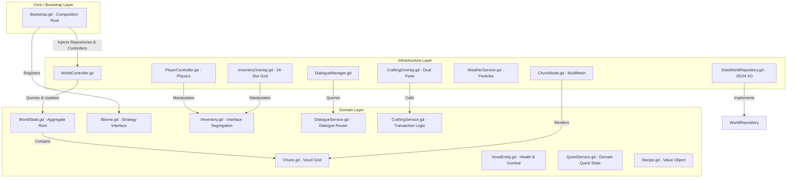
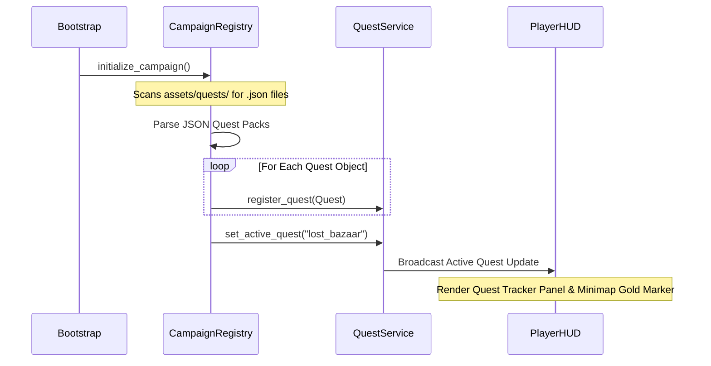
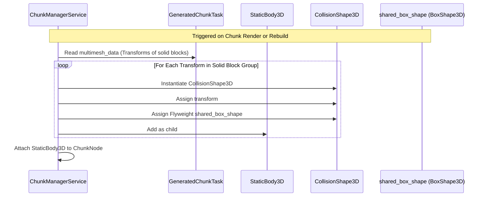
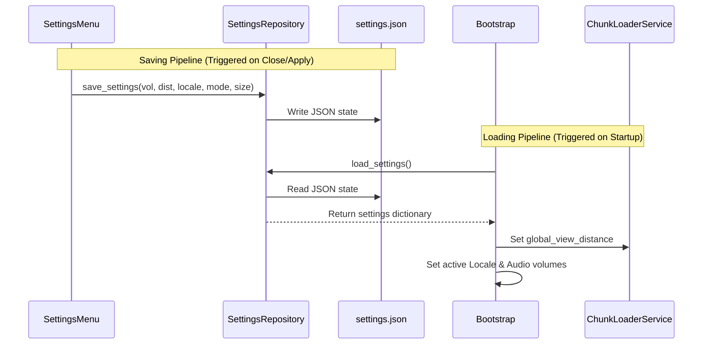
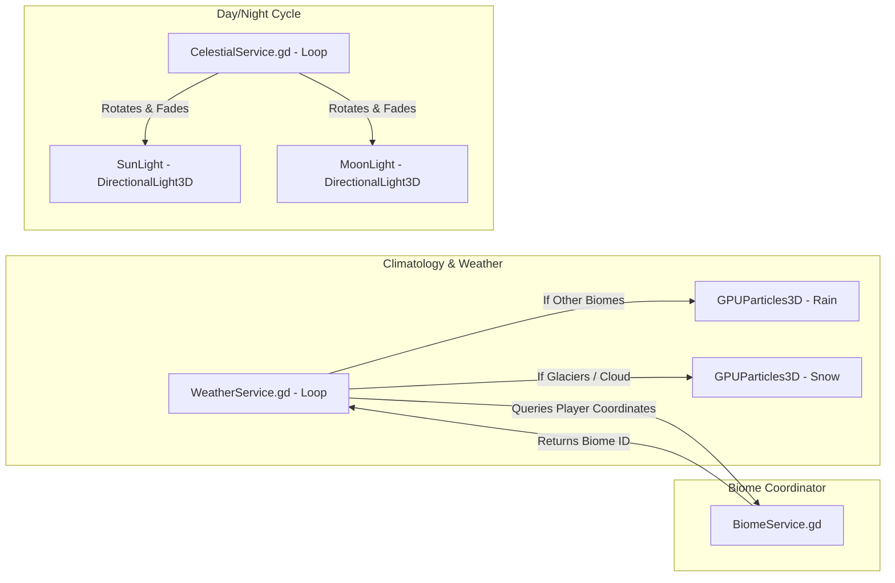

# CraftDomain

A high-performance, infinite voxel sandbox game engine built in **Godot 4.6.3** adhering to **Domain-Driven Design (DDD)** principles and strict **SOLID** software engineering compliance. Architected to demonstrate highly decoupled, modular, and extensible systems without sacrificing runtime execution speed.

---

## Architectural Philosophy: Domain-Driven Design (DDD)

CraftDomain is architected using **Domain-Driven Design (DDD)**. By segregating the codebase into distinct layers, we isolate pure business rules (the "Domain") from framework-specific engine details (the "Infrastructure"), such as Vulkan rendering, physics colliders, and disk I/O.

### Layer Segmentation & Dependency Flow

1. **The Domain Layer (`src/Domain/`):** Contains the core business logic. It has zero dependencies on Godot's scene tree, physics servers, or rendering API. It consists of:
   * **Aggregates & Entities:** `WorldState.gd` (Aggregate Root managing chunks), `Chunk.gd` (Voxel Grid), `VoxelEntity.gd` (Logical health rules), and `Quest.gd` (Logical quest representation).
   * **Value Objects:** `BlockDefinition.gd` (Immutable block traits and procedural color definitions) and `Recipe.gd` (Encapsulates required inputs and output attributes for crafting).
   * **Domain Services:** `TradingService.gd` (Decoupled inventory transaction rules), `BiomeService.gd` (Dynamic biome routing), `StructureLibrary.gd` (Blueprint routing), `QuestService.gd` (Decoupled quest state coordinator), and `CraftingService.gd` (Validates and processes formula requirements globally across grid networks).
   * **Interfaces:** `IInventory.gd` (Segregated inventory contract supporting item-ID stacking queries) and `WorldRepository.gd` (Persistence contract).

2. **The Infrastructure Layer (`src/Infrastructure/`):** Concrete implementations of hardware-bound or framework-bound systems.
   * **Rendering & Materials (`src/Infrastructure/Rendering/`):** `ChunkNode.gd` segments rendering transforms into individual, block-type MultiMesh nodes, applying PBR materials and custom GPU shaders. `ChunkVisualBuilder.gd` extracts physical meshes and groups MultiMesh matrices efficiently on background threads.
   * **Physics & Interactions (`src/Infrastructure/Player/`):** First-person motion physics, camera rotation, head bobbing, and decoupled raycast interaction solvers.
   * **Persistence (`src/Infrastructure/Persistence/`):** `DiskWorldRepository.gd` implements JSON delta serialization inside Godot's safe `user://` directory, now supporting full 24-slot inventory status profiles.
   * **Life & AI (`src/Infrastructure/Life/`):** Physics-bound passive and hostile AI, rendering programmatic 3D box-composition models and scheduling walk/idle tasks. Includes coordinate-seeded deterministic aesthetic variants, conversation gaze-locks, and a polymorphic loot-drop engine.

3. **The Core/Bootstrap Layer (`src/Core/Bootstrap`):**
   * Acts as the **Composition Root**. It instantiates the required database repositories, configures environment nodes, registers biomes/structures, and injects loose dependencies during scene transitions, ensuring no circular compiler loops exist. To preserve SRP, registries (like Mobs and Biomes) initialize their concrete strategies within their own services dynamically.

---

## SOLID Software Engineering Compliance

The architecture of CraftDomain is highly optimized to comply with the five SOLID software engineering design principles:

### 1. Single Responsibility Principle (SRP)
Each class has a single, strictly defined reason to change:
* **`WorldController.gd`:** Offloaded from physical and visual meshing calculations. It acts strictly as an asynchronous coordinator for chunk I/O and thread scheduling, delegating 3D matrix grouping to the stateless `ChunkVisualBuilder.gd`.
* **`PlayerController.gd`:** Responsible *only* for movement physics, camera input handling, and velocity calculations. It delegates all raycasting, block mining, building, eating, and combat actions to `VoxelInteractionComponent.gd`.
* **`VoxelInteractionComponent.gd`:** Attached as an isolated component under the camera, this class handles targeted block raycasting, highlighted meshes, block placement/removal, eating items, and speaking with NPCs.
* **`PlayerHUD.gd`:** Acts strictly as a lightweight orchestrator for the UI composition. It delegates specific layout configurations and real-time mathematical calculations to dedicated widgets: `MinimapWidget`, `GPSPanelWidget`, and `QuestTrackerWidget`.
* **`CraftingOverlay.gd` / `InventoryOverlay.gd`:** Handle only visual rendering of grid slots, checking checklists, and capturing clicks. They delegate all transaction modifications to `CraftingService` and `IInventory`.
* **`SettingsRepository.gd`:** Handles exclusively the serialization and disk I/O of system parameters (volume, render distance, window modes, and locales), completely decoupling settings persistence from the user interface and the core bootstrap lifecycle.

### 2. Open-Closed Principle (OCP)
*Classes are open for extension, but closed for modification.*
CraftDomain utilizes data-driven registry, loading, and strategy patterns to ensure new content can be added without modifying existing code.

#### The Data-Driven Quest & Campaign System
Instead of hardcoding quests inside scripts, the system reads from external JSON quest configuration files.

* **The Data-Driven Crafting & Blueprint System:** Similar to quests, all crafting recipes are parsed from `assets/recipes/recipes.json` by `RecipeRegistry.gd`. Adding a new recipe does not require modifying a single line of GDScript.
* **Dynamic Mob Spawning Registry:** Concrete entities are registered dynamically into the `MobRegistry` at startup, decoupling custom wildlife and NPC instantiation from the procedural spawner `MobSpawningService.gd`.
* **Data-Driven 1:1 Translations (i18n):** The engine dynamically loads translation data from `assets/translations/en.json` and `es.json`. Dialogue trees, item names, UI headers, and even floating speech bubbles are parsed using localization keys without hardcoding raw text in the controllers.
* **Birch Log Block Extension:** Birch logs are registered via the new `BlockType.Type.BIRCH_LOG = 24` mapping in `BlockType.gd` and `BlockLibrary.gd`. This replaces temporary placeholders, letting Birch Trees render textured white bark organically without altering the core procedural biome scatter logic.

### 3. Liskov Substitution Principle (LSP)
Subclasses must be substitutable for their base classes without altering program correctness:
* Any strategy implementing `IBiome` can be processed by `BiomeService` and evaluated by `WorldGenerator` without runtime exceptions.
* `DiskWorldRepository` inherits from `WorldRepository`, satisfying all contract signatures safely.
* Passive entities (`VillagerEntity`, `MinerEntity`, `GuardEntity`, `FarmerEntity`, `TurtleEntity`) inherit from `PassiveEntity`, implementing their custom shapes polymorphically while using the parent's base physics, blinking loops, variant seeding, and death sequences seamlessly.

### 4. Interface Segregation Principle (ISP)
*Clients should not be forced to depend upon interfaces they do not use.*
* Instead of passing the entire `PlayerController.gd` (which contains camera vectors, physics movement, and input states) to the trading, loot drop, or crafting systems, the game defines `IInventory.gd`.
* `TradingService`, `CraftingService`, and `PassiveEntity` (NPCs) interact *only* with the abstract `IInventory` interface, completely separating transaction logic from character movement and camera physics.

### 5. Dependency Inversion Principle (DIP)
*High-level modules must not depend on low-level modules; both must depend on abstractions.*
* `WorldController.gd` (High-level coordinator) never directly instantiates or imports `DiskWorldRepository.gd` (Low-level JSON file details).
* Instead, it holds a reference to the abstract class `WorldRepository`. The concrete `DiskWorldRepository` is instantiated and injected externally by `Bootstrap.gd` during boot.
* `VoxelInteractionComponent.gd` holds injectable references to `BlockLibrary` and `QuestService` providers rather than hardcoding static singletons, making the module completely mockable for testing.

---

## High-Performance Voxel Sandbox Optimizations

Voxel sandbox games are traditionally notorious for CPU and GPU bottlenecks. CraftDomain implements custom lower-level optimizations to maintain solid framerates:

### 1. Expanded Horizon Draw Distance (162-Chunk Radius)
Through massive occlusion culling and background thread matrix compilation within `ChunkVisualBuilder.gd`, `ChunkLoaderService` pushes a **9x2x9 3D loading grid**. This active volume of **162 procedural chunks** quadruples the standard visual draw distance natively without overwhelming the physics servers, supporting massive landscapes, deep ravines, and high-altitude Cloud Kingdoms.

### 2. Multi-Mesh Partitioned Rendering (Water & Lava Shading)
To support translucent, highly reflective water and glowing lava, `ChunkNode.gd` does not render a chunk using a single monolithic MultiMesh. Instead, it partitions chunk voxel arrays by their `BlockType` and instantiates a separate `MultiMeshInstance3D` for each active block type. This allows applying specialized materials:
* **Water Material:** Translucent blue color, roughness `0.05` (highly glossy) to enable beautiful Screen Space Reflections (SSR).
* **Glass Material:** High-gloss transparency allowing skylight penetration.
* **Lava Material:** Emission-enabled orange-red glow with a `1.8` multiplier.

### 3. Procedural Static Pixel Grain & Externalized GDShaders
The visual codebase applies clean, external `.gdshader` resource files (decoupled from GDScript files). Solid blocks utilize a fast **Triplanar Shader**, while foliage utilizes a **Wind-Sway Leaf Shader**. Additionally, all NPC and wildlife characters are procedurally painted with a static, pre-compiled micro-pixel `NoiseTexture2D` blended over their base colors using `TEXTURE_FILTER_NEAREST`, instantly producing highly detailed, retro-voxel pixel-art aesthetics globally with zero runtime GPU overhead.

### 4. Static Texture Preloader (Lag Spike Prevention)
Decoding high-resolution (1024x1024) PNG files on the main thread during real-time chunk loading causes massive CPU stalls, resulting in physics tunneling. CraftDomain utilizes a **Static Preloader** in `ChunkNode.gd` that reads, caches, and compiles all custom textures into GPU memory *once* during game boot, keeping the gameplay completely stutter-free.

### 5. Primitive Box Flyweight Collision Grid
Traditional `ConcavePolygonShape3D` meshes (triangle soups with zero volume) are prone to corner traps and seam-clinging bugs when characters move against them. To resolve this, `ChunkManagerService.gd` parses active solid rendering transforms and constructs a grid of primitive solid `BoxShape3D` colliders. To prevent memory and allocation bottlenecks, the service implements the **Flyweight Design Pattern**, sharing a single static `BoxShape3D` resource instance across every collision shape inside the static body. This provides native physical volume to the world, resolving collision tunneling and enabling standard Capsule-to-Box sliding physics.

### 6. Time-Sliced Priority Rebuild Queue (Zero-Latency Editing)
To prevent direct player actions (mining, building) from being delayed behind background thread terrain generation queues (which load hundreds of distant chunks as the player walks), the task scheduler implements a priority bypass. Standard loading requests are appended to the back of the queue, while real-time rebuilding requests use `.push_front()`. This ensures user interactions are processed on the very next frame, reducing block modification latency from seconds to milliseconds.

---

## Persistent Configuration Settings Pipeline

To persist system preferences (audio volumes, window properties, language, and render distance), the engine implements a dedicated saving/loading pipeline decoupled from world files. 

By encapsulating I/O operations inside `SettingsRepository.gd`, UI components write to disk only during key events (such as pressing the back button or applying resolutions), protecting SSD/storage health from continuous drag-write loops.

---

## Dynamic Weather & Atmospheric Cycles

The world features an integrated celestial and climatological loop coordinating sun, moon, and weather states:

### 1. Deterministic Sky & Weather-Integrated Shader
The world features a custom GPU Sky Shader (`celestial_sky.gdshader`) integrated with the celestial clock:
* **True Celestial Orbits:** The Sun disk and Moon crescent are rendered on the sky dome using coordinates passed dynamically from `CelestialService.gd`.
* **Twinkling Starfield:** A procedural, rotating 3D starfield fades in at night and dims as dawn approaches.
* **Dynamic Weather Overcast:** The shader reads the `storm_weight` uniform. When rain/snow begins, the sky smoothly fades to a heavy slate-grey over 5 seconds. Flat ceiling clouds, generated seamlessly via 3-Octave **GPU Fractional Brownian Motion (FBM)**, automatically thicken and dim the celestial bodies to mimic heavy storms.

### 2. Regional Climatology
`WeatherService.gd` manages dynamic weather shifts (Sunny, Rainy, Snowy) that interact with regional biomes:
* **The Performance Emitter:** The particle system is positioned exactly above the player's head, ensuring it only rains/snows in their immediate vicinity, protecting GPU fillrate.
* **Dynamic Biome Detection:** If precipitation begins and the player is in `Frostbite Glaciers` or `Cloud Kingdom`, the system automatically alters the particle mesh to slowly drifting, wind-blown white snowflakes. In other biomes, it falls as fast, translucent blue rain needles.

---

## Procedural World Generation & Regional Biomes

The world dynamically loads infinite terrain across 10 fully distinct environments, each boasting unique geographic rules, flora blueprints, and specialized NPC populations:

*   **Bay of Sails (Ocean):** Blue water expanses populated by aquatic Sea Turtles (`ID 201`). NPCs spawn in striped sailor outfits.
*   **Warp Plateau (Steps):** Vibrant green step-topography generating Warp Pipes and Giant Mario Mushrooms.
*   **Golden Bazaar (Plains):** Classical grasslands populated with Oak Trees (`ID 1`), Birch Trees (`ID 13`), Sakura Trees (`ID 10`), and beautiful flowering Rose Bushes (`ID 12`).
*   **Craggy Peaks & Caves:** Deep grey mountains and underground caverns illuminated dynamically by Cave Miners (`ID 105`) wearing active, sweeping 3D headlamp spotlight helmets.
*   **Frostbite Glaciers (Polo):** Freezing winter basin where NPCs spawn clothed in thick thermal fur hoods to withstand the snow.
*   **Whispering Redwood Forest:** Mossy canopies dominated by colossal 12-block high Redwood Trees. Inhabited by Forest Druids (`ID 104`) wielding longbows.
*   **Neon Ruins (Cyber Basin):** Obsidian and magenta stepped pyramids. Guarded by highly advanced Cyber Citizens (`ID 106`) with glowing circuitry.
*   **Red Sandstone Canyons:** Terraced badlands deserts decorated with twisted, woody Dead Shrubs (`ID 14`).
*   **Swamp of Sighs (Mist Bay):** Thick brown mud valleys populated by mysterious swamp alchemists in tattered cowls.
*   **Cloud Kingdom:** High-altitude floating white cloud islands supporting angelic inhabitants.

**Global Mega-Structures (Fixed POIs):**
Massive, multi-chunk architectural marvels are spawned dynamically at fixed coordinates (e.g., Grand Castle at `[200, 200]`, Harbor City at `[-150, 0]`, Nether Portal Outpost at `[-300, -300]`). These locations spawn heavily armored Guards and coordinate-specific interactions.

---

## Decoupled SOLID UI Architecture

To satisfy the Single Responsibility Principle, the HUD is separated into modular, decoupled widgets managed under `PlayerHUD.gd`:

* **`MinimapWidget.gd`:** Renders the 2D circular radar, tracking the player arrow, regional biome colors, and auto-guided quest marker dots.
* **`GPSPanelWidget.gd`:** An elegant, localized overlay tracking coordinate grids, clock cycles, current biomes, and a procedural compass pointing directly toward the closest Global Mega-Structure.
* **`MapOverlay.gd`:** A fullscreen glassmorphic tactical world map enabling instant OCP-compliant fast-travel to discovered POIs. Transitions are smoothed using the dynamic cinematic `LoadingScreen.gd`.

### Minecraft-Style Centered HUD Layout
The HUD has been fully overhauled to emulate the standardized layout of modern block sandbox games:
* **Unified Center-Bottom Dock:** The 8 hotbar slots are grouped inside a sleek, glassmorphic bottom bar. The `🎒` (Backpack Inventory) and `🛠️` (Crafting Workshop) buttons are docked symmetrically.
* **Aligned Status Bars:** Red Hearts (`❤ ❤ ❤`) float above the left half of the hotbar. Crispy Chicken Drumsticks (`🍗 🍗 🍗`) float above the right half.

---

## Inventory & Crafting Workshop Systems

### 1. Stack-Based Grid Inventory (`InventoryComponent.gd`)
The fixed inventory system has been refactored to support a fully dynamic **24-slot stackable grid**:
* **Grid Partitioning:** Slots 0 to 7 act as the active gameplay hotbar (synced to the HUD), while slots 8 to 23 form the extra 16-slot backpack storage (visible inside the Backpack screen).
* **Dynamic Stacking:** Items stack up to 64 units per slot, allowing multiple stacks of the same block types (e.g., Stone, Wood) to occupy separate slots.
* **Sequential Swapping Engine:** Pressing `I` opens the glassmorphic Backpack menu. Clicking Slot A (glows in gold) and then Slot B swaps their contents physically. This allows seamless backpack sorting and hotbar rearranging.
* **Inspector & Consumption Panel:** Clicking an item opens its technical description card, current stock metrics, usage instructions, and action buttons. Consumable foods like Fried Chicken can be eaten directly from the menu, restoring health and updating status bars in real-time.

### 2. Context-Aware Crafting Workshop (`CraftingOverlay.gd`)
Pressing `C` opens a dual-pane Blueprint Workshop overlay:
* **Blueprint Catalog (Left Pane):** Scrollable deck showing all available recipes parsed dynamically from `recipes.json`. Card margins are color-coded to match the output block types.
* **Visual Checklist (Right Pane):** Selecting a recipe displays its name, result count, and a color-coded checklist of required ingredients compared with the player's total inventory count (green if satisfied, red if missing).
* **Manufacturing Transaction:** Clicking the "Fabricate" button consumes the inputs globally across the grid, grants the crafted outcome, triggers a viewmodel hand-swing, and pops a sliding success notification.

---

## Advanced Procedural NPC AI & Rigging

The engine features highly reactive, modular, and procedurally generated non-player characters (NPCs):

*   **Deterministic Aesthetic Variants:** NPCs derive their physical traits (skin tone, clothing color, hair color, and height scaling) mathematically from their spawning coordinates. No two villagers look alike, yet they remain consistent upon reloading.
*   **Conversational Gaze-Locks & Dynamic Dialogue:** When interacted with, NPCs freeze their patrol velocities and execute real-time geometric rotation slerps to lock eye contact with the player. Instead of static greetings, they draw from procedural dialogue pools that evaluate the time of day, their active biome, and variant identity strings.
*   **Proactive Threat Detection (PANIC):** Passive entities actively track coordinate radiuses. If a hostile Zombie approaches, they enter a PANIC state, wildly sprinting in the opposite direction while bouncing at a high-frequency pace.
*   **Defensive Aggro Chasing (GUARDS):** Guard entities refuse to panic. They physically draw their sheathed iron broadswords from their backs, sprint towards hostiles, and execute coordinated striking cooldowns to deal damage and knockback to protecting the village.
*   **Polymorphic Loot System:** Implementing the unified Death Engine, all creatures and NPCs trigger a physical shrinking animation accompanied by GPU smoke particles before deleting themselves and safely delegating specific drop tables (meat, wool proxy leaves, etc.) straight to the `IInventory` interface.

---

## Controls Reference

* **`W`, `A`, `S`, `D` or Arrow Keys:** Move around.
* **Mouse Movement:** Look around (Smooth camera rotation processed inside `_unhandled_input` to match high-refresh monitor rates).
* **`Space`:** Jump.
* **`M`:** Open Fullscreen Tactical Map & Fast Travel.
* **`I` (or clicking the HUD 🎒 button):** Toggle the 24-slot Backpack Inventory & Inspector overlay.
* **`C` (or clicking the HUD 🛠️ button):** Toggle the Context-aware Crafting & Blueprint Workshop.
* **`Left Alt` (Hold):** Release the captured mouse cursor to click HUD shortcut buttons.
* **Mouse Scroll Wheel or Keys `1` to `8`:** Scroll through Hotbar slots.
* **Left-Click (or `E`):** Mine blocks (generating color-matched voxel debris particles) or swing the active weapon.
* **Right-Click (or `Q`):** Place blocks, plant seeds, consume items, or interact (Talking with villagers/guards/miners).
* **`Escape`:** Unlocks mouse cursor, pauses game, and triggers a silent background auto-save.

---

## License

This project is licensed under the MIT License.
