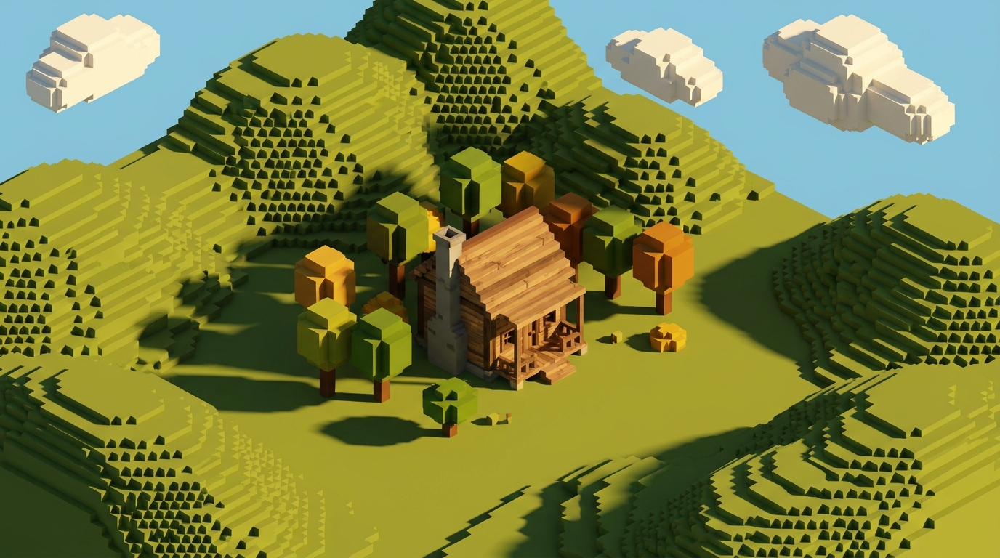
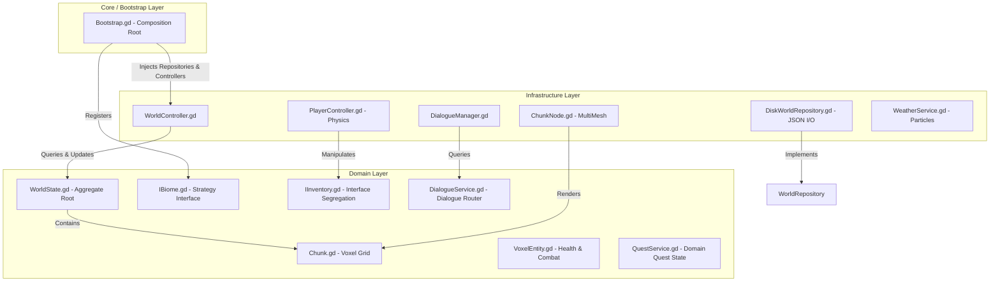
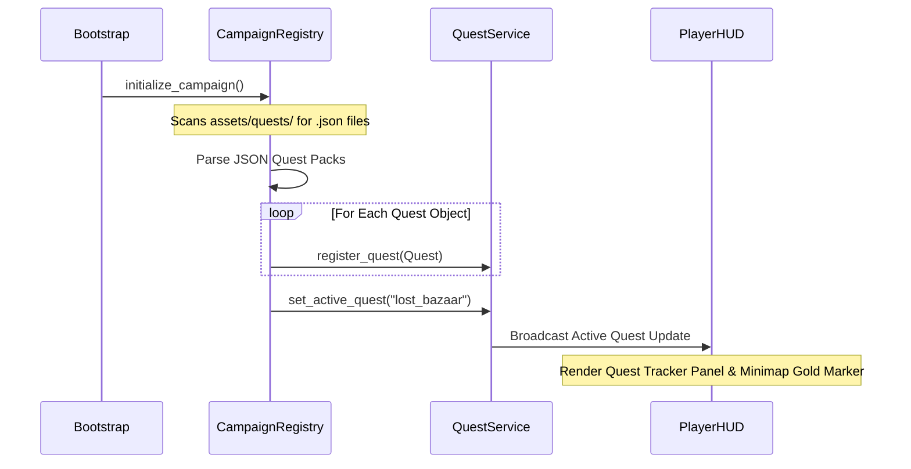
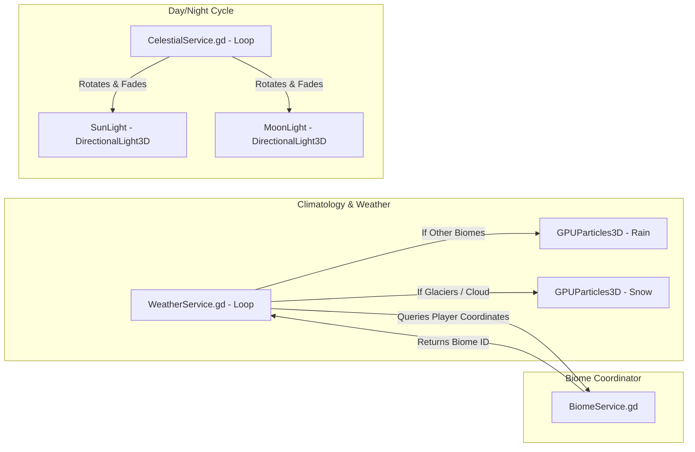

# CraftDomain



A high-performance, infinite voxel sandbox game engine built in **Godot 4.6.3** adhering to **Domain-Driven Design (DDD)** principles and strict **SOLID** software engineering compliance. Architected to demonstrate highly decoupled, modular, and extensible systems without sacrificing runtime execution speed.

---

## Architectural Philosophy: Domain-Driven Design (DDD)

CraftDomain is architected using **Domain-Driven Design (DDD)**. By segregating the codebase into distinct layers, we isolate pure business rules (the "Domain") from framework-specific engine details (the "Infrastructure"), such as Vulkan rendering, physics colliders, and disk I/O.

### Layer Segmentation & Dependency Flow



1. **The Domain Layer (`src/Domain/`):** Contains the core business logic. It has zero dependencies on Godot's scene tree, physics servers, or rendering API. It consists of:
   * **Aggregates & Entities:** `WorldState.gd` (Aggregate Root managing chunks), `Chunk.gd` (Voxel Grid), `VoxelEntity.gd` (Logical health rules), and `Quest.gd` (Logical quest representation).
   * **Value Objects:** `BlockDefinition.gd` (Immutable block traits and procedural color definitions).
   * **Domain Services:** `TradingService.gd` (Decoupled inventory transaction rules), `BiomeService.gd` (Dynamic biome routing), `StructureLibrary.gd` (Blueprint routing), and `QuestService.gd` (Decoupled quest state coordinator).
   * **Interfaces:** `IInventory.gd` (Segregated inventory contract) and `WorldRepository.gd` (Persistence contract).

2. **The Infrastructure Layer (`src/Infrastructure/`):** Concrete implementations of hardware-bound or framework-bound systems.
   * **Rendering & Materials (`src/Infrastructure/Rendering/`):** `ChunkNode.gd` segments rendering transforms into individual, block-type MultiMesh nodes, applying PBR materials and custom GPU shaders.
   * **Physics & Interactions (`src/Infrastructure/Player/`):** First-person motion physics, camera rotation, and decoupled raycast interaction solvers.
   * **Persistence (`src/Infrastructure/Persistence/`):** `DiskWorldRepository.gd` implements JSON delta serialization inside Godot's safe `user://` directory.
   * **Life & AI (`src/Infrastructure/Life/`):** Physics-bound passive and hostile AI, rendering programmatic 3D box-composition models and scheduling walk/idle tasks.

3. **The Core/Bootstrap Layer (`src/Core/Bootstrap`):**
   * Acts as the **Composition Root**. It instantiates the required database repositories, configures environment nodes, registers biomes/structures, and injects loose dependencies during scene transitions, ensuring no circular compiler loops exist.

---

## SOLID Software Engineering Compliance

The architecture of CraftDomain is highly optimized to comply with the five SOLID software engineering design principles:

### 1. Single Responsibility Principle (SRP)
Each class has a single, strictly defined reason to change:
* **`PlayerController.gd`:** Responsible *only* for movement physics, camera input handling, and velocity calculations. It delegates all raycasting, block mining, building, eating, and combat actions to `VoxelInteractionComponent.gd`.
* **`VoxelInteractionComponent.gd`:** Attached as an isolated component under the camera, this class handles targeted block raycasting, highlighted meshes, block placement/removal, eating items, and speaking with NPCs.
* **`PlayerHUD.gd`:** Acts strictly as a lightweight orchestrator for the UI composition. It delegates specific layout configurations and real-time mathematical calculations to dedicated widgets: `MinimapWidget`, `GPSPanelWidget`, and `QuestTrackerWidget`.

### 2. Open-Closed Principle (OCP)
*Classes are open for extension, but closed for modification.*
CraftDomain utilizes data-driven registry, loading, and strategy patterns to ensure new content can be added without modifying existing code.

#### The Data-Driven Quest & Campaign System
Instead of hardcoding quests inside scripts, the system reads from external JSON quest configuration files.



To add more quests, a developer drops a new JSON file (e.g., `res://assets/quests/sidequests.json`) into the directory. The `CampaignRegistry` dynamic directory scanner automatically parses and registers it at startup without modifying a single line of GDScript.

### 3. Liskov Substitution Principle (LSP)
Subclasses must be substitutable for their base classes without altering program correctness:
* Any strategy implementing `IBiome` can be processed by `BiomeService` and evaluated by `WorldGenerator` without runtime exceptions.
* `DiskWorldRepository` inherits from `WorldRepository`, satisfying all contract signatures safely.
* Passive entities (`VillagerEntity`, `MerchantEntity`, `GuardEntity`, `FarmerEntity`) inherit from `PassiveEntity`, implementing their custom shapes polymorphically while using the parent's base physics and animation loops seamlessly.

### 4. Interface Segregation Principle (ISP)
*Clients should not be forced to depend upon interfaces they do not use.*
* Instead of passing the entire `PlayerController.gd` (which contains camera vectors, physics movement, and input states) to the trading or loot drop systems, the game defines `IInventory.gd`.
* `TradingService` and `PassiveEntity` (NPCs) interact *only* with the `IInventory` interface, completely separating transaction logic from character movement and camera physics.

### 5. Dependency Inversion Principle (DIP)
*High-level modules must not depend on low-level modules; both must depend on abstractions.*
* `WorldController.gd` (High-level coordinator) never directly instantiates or imports `DiskWorldRepository.gd` (Low-level JSON file details).
* Instead, it holds a reference to the abstract class `WorldRepository`. The concrete `DiskWorldRepository` is instantiated and injected externally by `Bootstrap.gd` during boot.

---

## High-Performance Game Engine Optimizations

Voxel sandbox games are traditionally notorious for CPU and GPU bottlenecks. CraftDomain implements custom lower-level optimizations to maintain solid framerates:

### 1. Multi-Mesh Partitioned Rendering (Water & Lava Shading)
To support translucent, highly reflective water and glowing lava, `ChunkNode.gd` does not render a chunk using a single monolithic MultiMesh. Instead, it partitions chunk voxel arrays by their `BlockType` and instantiates a separate `MultiMeshInstance3D` for each active block type. This allows applying specialized materials:
* **Water Material:** Translucent blue color, roughness `0.05` (highly glossy) to enable beautiful Screen Space Reflections (SSR).
* **Lava Material:** Emission-enabled orange-red glow with a `1.8` multiplier.
* **Solid Blocks:** Use OCP-compliant custom PBR textures.

### 2. Custom GPU Blending & Triplanar Shader
Using custom PNG textures (especially AI-generated ones) on voxels often results in vertical texture stretching or solid black blocks. CraftDomain implements a custom **GPU Blending Triplanar Shader** in `ChunkNode.gd` that resolves both issues:
* **Decal Triplanar Projection:** Projects textures from X, Y, and Z axes based on local vertex positions, ensuring perfectly square, non-stretched pixel mapping on all 6 faces of the cube.
* **Alpha Blending Fallback:** Automatically blends the texture colors with the block's base procedural fallback color using the texture's alpha channel. If a pixel is transparent, it renders the rich biome-specific color instead of turning black.

### 3. Static Texture Preloader (Lag Spike Prevention)
Decoding high-resolution (1024x1024) PNG files on the main thread during real-time chunk loading causes massive CPU stalls, resulting in physics tunneling. CraftDomain utilizes a **Static Preloader** in `ChunkNode.gd` that reads, caches, and compiles all custom textures into GPU memory *once* during game boot, keeping the gameplay completely stutter-free.

---

## Dynamic Weather & Atmospheric Cycles

The world features an integrated celestial and climatological loop coordinating sun, moon, and weather states:



### 1. Deterministic GPU Sky & Weather-Integrated Shader
The world features a custom GPU Sky Shader (`EnvironmentBuilder.gd`) integrated with the celestial clock:
* **True Celestial Orbits:** The Sun disk and Moon crescent are rendered on the sky dome using coordinates passed dynamically from `CelestialService.gd`.
* **Twinkling Starfield:** A procedural, rotating 3D starfield fades in at night and dims as dawn approaches.
* **Dynamic Weather Overcast:** The shader reads the `storm_weight` uniform. When rain/snow begins in `WeatherService.gd`, the sky smoothly fades to a heavy, plomizo slate-grey over 5 seconds. Clouds generated via procedural GPU Fractional Brownian Motion (FBM) thicken, and the Sun and Moon disks are dimmed by 85% to simulate thick overcast weather.

### 2. Regional Climatology
`WeatherService.gd` manages dynamic weather shifts (Sunny, Rainy, Snowy) that interact with regional biomes:
* **The Performance Emitter:** The particle system is positioned exactly above the player's head, ensuring it only rains/snows in their immediate vicinity, protecting GPU fillrate.
* **Dynamic Biome Detection:** If precipitation begins and the player is in `Frostbite Glaciers` or `Cloud Kingdom`, the system automatically alters the particle mesh to slowly drifting, wind-blown white snowflakes. In other biomes, it falls as fast, translucent blue rain needles.

---

## Decoupled SOLID UI Architecture

To satisfy the Single Responsibility Principle, the HUD is separated into modular, decoupled widgets managed under `PlayerHUD.gd`:

* **`MinimapWidget.gd`:** Renders the 2D circular radar, the player's white arrow with a thick black outline, and the active quest's pulsing hot-pink navigation diamond (designed to clamp to the compass rim when far away).
* **`GPSPanelWidget.gd`:** A clean overlay that displays coordinates, the celestial clock, and active region biomes with high-contrast text outlines, freeing up screen space.
* **`QuestTrackerWidget.gd`:** Renders active quest descriptions, remaining distance in meters, and gathering progress. To prevent clutter, the widget automatically hides itself completely when all campaign quests are completed.

### Minecraft-Style Minimalist Hotbar
The hotbar has been optimized for visual clarity:
* **Procedural Icons:** Each slot features a center-anchored color block (`22x22` pixels) representing its block type (e.g., grey for Stone, green for Grass, glowing orange for Lava, iron grey for the Sword).
* **Quantity Overlays:** Numeric item counts are drawn in the bottom-right corner of each slot over the item icon. Infinite items, like the Sword, display no numbers.
* **Fading Selected Item Toast:** When switching slots, the full name of the item (e.g., `STONE BLOCK`) is displayed in a large label above the hotbar. After 1.8 seconds of inactivity, the label fades out smoothly to ensure maximum immersion.

---

## Procedural NPC Animation & Rigging

NPCs are designed with a layered hierarchical box structure attached to a dedicated walking joint (`_body_bob_node`):
* **Procedural Walk Bouncing:** When walking, the entire model undergoes a vertical bouncing animation resembling footsteps. When idling, the model exhibits a slow, natural breathing animation.
* **Overhauled Aesthetics:**
  * **Villagers:** Rigged with detailed leather boots, belts with iron buckles, and folded arms.
  * **Merchants:** Modeled with silk turbans featuring emerald gems on the forehead, royal violet robes, and layered gold aprons.
  * **Guards:** Styled with steel-plated armor, bulky 3D shoulder pauldrons, helmet visors, sheathed iron swords, and knightly wooden heater shields on their backs.
  * **Farmers:** Rigged with muddy field boots, blue dungarees with suspender straps, wide-brim straw hats, and sheathed harvesting wooden hoes.

---

## Directory Layout & Specifications

```
.
├── MANUAL.md                  # Gameplay and economic instruction manual
├── README.md                  # Technical engine documentation
├── project.godot              # Godot project settings (Physics @ 120Hz, Forward+)
└── src
	├── Core
	│   └── Bootstrap          # Application entry-point and dependency injector
	├── Domain
	│   ├── Dialogue           # Pure dialogue data nodes
	│   ├── Life               # Pure domain models (Combat state, health limits)
	│   ├── Player             # Segregated IInventory interfaces
	│   ├── Quest              # Pure quest entities and domain coordinators
	│   └── World              # Strategy patterns (IBiome, Blueprints, Block Definitions)
	└── Infrastructure
		├── Audio              # Programmatic loops and parallel crossfaders
		├── Celestial          # Day/night orbits and Weather particle generators
		├── Dialogue           # Dialogue manager and UI adapters
		├── Life               # Physics controllers, NPCs, blinking, and spawning
		├── Persistence        # Safe JSON save delta serializers
		├── Player             # FP controllers, viewmodels, and interaction components
		├── Rendering          # MultiMesh chunk nodes and custom GPU shaders
		└── UI                 # Glassmorphic sub-widgets, compasses, and pause overlays
```

---

## Controls Reference

* **`W`, `A`, `S`, `D` or Arrow Keys:** Move around.
* **Mouse Movement:** Look around (Smooth camera rotation processed inside `_unhandled_input` to match high-refresh monitor rates).
* **`Space`:** Jump.
* **Mouse Scroll Wheel or Keys `1` to `8`:** Scroll through Hotbar slots:
  * `1` (Stone), `2` (Dirt), `3` (Grass), `4` (Wood), `5` (Leaves), `6` (Lava Bucket), `7` (Fried Chicken), `8` (Sword).
* **Left-Click (or `E`):** Mine blocks (generating color-matched voxel debris particles) or swing the active weapon.
* **Right-Click (or `Q`):** Place blocks, consume items (eating Fried Chicken to heal), or interact (trading with the Purple-Robed Merchant, talking to villagers).
* **`Escape`:** Unlocks mouse cursor, pauses game, and triggers a silent background auto-save.

---

## License

This project is licensed under the MIT License.
