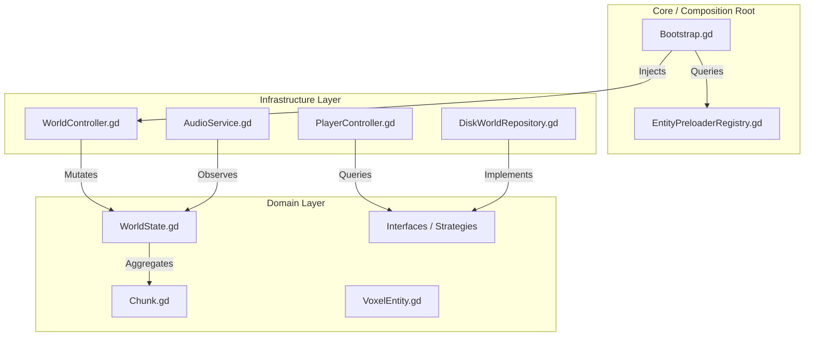
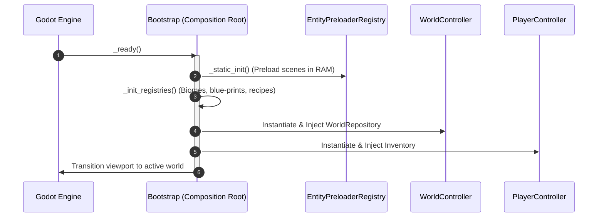
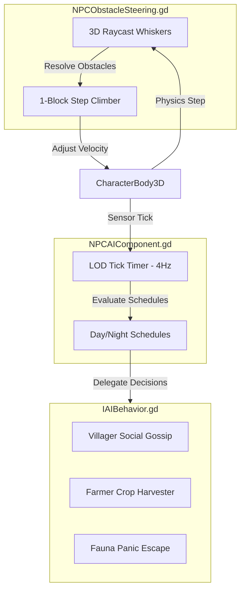
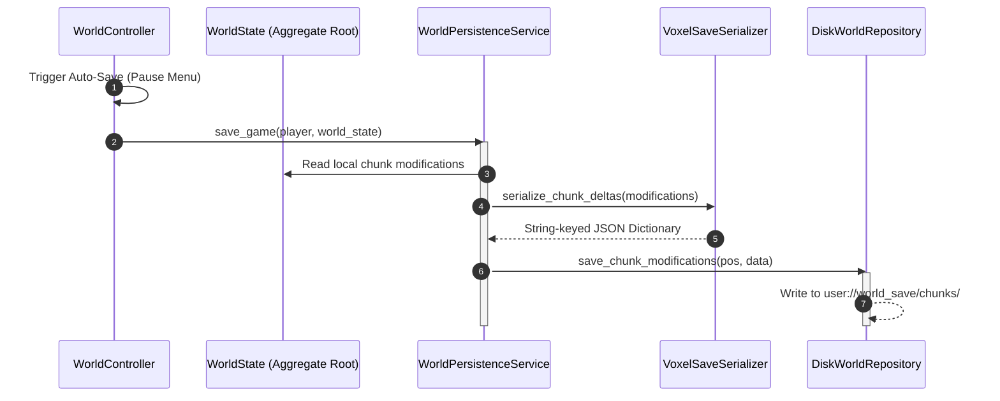

# CraftDomain

A high-performance, commercial-grade infinite procedural voxel sandbox game engine built in **Godot 4.6.3** adhering to strict **Domain-Driven Design (DDD)** principles, Conventional Commits tracking, and rigorous **SOLID** software engineering compliance. Architected to demonstrate a highly decoupled, modular, and extensible system capable of maintaining a locked, rock-solid **120 FPS** with smooth frame pacing in massive, thread-populated 3D environments.

---

## 🏗️ Architectural Philosophy: Domain-Driven Design (DDD)

CraftDomain is architected using **Domain-Driven Design (DDD)** patterns. By segregating the codebase into distinct layers, we isolate pure business rules (the "Domain") from framework-specific engine details (the "Infrastructure"), such as Vulkan rendering, physics bodies collisions, disk JSON I/O, and audio buses.

### 1. Architectural Layers & Dependency Flow
To enforce a strict one-way dependency flow where dependencies point exclusively inwards toward the Domain, the system's boundary limits are segmented as follows:

```mermaid
graph TD
	subgraph Core_Layer [Core / Composition Root]
		Bootstrap[Bootstrap.gd]
		Preloader[EntityPreloaderRegistry.gd]
	end

	subgraph Infra_Layer [Infrastructure Layer]
		Controller[WorldController.gd]
		Player[PlayerController.gd]
		Persistence[DiskWorldRepository.gd]
		Audio[AudioService.gd]
	end

	subgraph Domain_Layer [Domain Layer]
		State[WorldState.gd]
		Chunk[Chunk.gd]
		Entity[VoxelEntity.gd]
		Interfaces[Interfaces / Strategies]
	end

	Bootstrap -->|Injects| Controller
	Bootstrap -->|Queries| Preloader
	Controller -->|Mutates| State
	State -->|Aggregates| Chunk
	Player -->|Queries| Interfaces
	Persistence -->|Implements| Interfaces
	Audio -->|Observes| State
```

---

### 2. Startup Initialization & Boot Sequence
The **Composition Root** (`Bootstrap.gd`) orchestrates the initial boot sequence in RAM, preloading assets and injecting decoupled dependencies during the viewport transition:

```mermaid
sequenceDiagram
	autonumber
	participant Engine as Godot Engine
	participant Boot as Bootstrap (Composition Root)
	participant Cache as EntityPreloaderRegistry
	participant Ctrl as WorldController
	participant Player as PlayerController

	Engine->>Boot: _ready()
	activate Boot
	Boot->>Cache: _static_init() (Preload scenes in RAM)
	Boot->>Boot: _init_registries() (Biomes, blue-prints, recipes)
	Boot->>Ctrl: Instantiate & Inject WorldRepository
	Boot->>Player: Instantiate & Inject Inventory
	Boot->>Engine: Transition viewport to active world
	deactivate Boot
```

---

### 3. Voxel Rendering & Chunk Meshing Pipeline
Voxel geometry calculations, face culling, and transparent normal-baking are compiled in parallel threads, allowing zero-latency mesh updates during real-time world edits:

```mermaid
graph LR
	subgraph CPU_Generation [Thread-Pool Compile Loop]
		Builder[ChunkVisualBuilder.gd]
		Mesher[ChunkMesher.gd]
		NormalBaker[CPU Normal Baker]
	end

	subgraph GPU_Render [Vulkan Server]
		Node[ChunkNode.gd]
		Shader[Triplanar Shader]
		Material[VoxelMaterialFactory.gd]
	end

	WorldState[WorldState.gd] -->|Read Chunk Grid| Builder
	Builder -->|Occlusion Face Culling| Mesher
	Mesher -->|Bake Slabs & Fluid Normals| NormalBaker
	NormalBaker -->|Commit Mesh Buffers| Node
	Node -->|Apply Cached Materials| Material
	Material -->|Bake Parameters| Shader
```

---

### 4. Decoupled AI Brain & Steering Strategy
Humanoids and wildlife delegates sensory scans and pathing decisions to pure Domain strategies. Walk cycle interpolations and obstacle-jumping are offloaded to lightweight components:

```mermaid
graph TD
	subgraph Sensory_Brain [NPCAIComponent.gd]
		Timer[LOD Tick Timer - 4Hz]
		Schedule[Day/Night Schedules]
	end

	subgraph Steering_Network [NPCObstacleSteering.gd]
		Whiskers[3D Raycast Whiskers]
		StepClimb[1-Block Step Climber]
	end

	subgraph Decision_Strategy [IAIBehavior.gd]
		Gossip[Villager Social Gossip]
		Harvest[Farmer Crop Harvester]
		Flee[Fauna Panic Escape]
	end

	Host[CharacterBody3D] -->|Sensor Tick| Timer
	Timer -->|Evaluate Schedules| Schedule
	Schedule -->|Delegate Decisions| Decision_Strategy
	Host -->|Physics Step| Whiskers
	Whiskers -->|Resolve Obstacles| StepClimb
	StepClimb -->|Adjust Velocity| Host
```

---

### 5. Persistence, Serialization & I/O Boundaries
World persistence implements a background **Delta-Saving** pipeline, preserving modified chunk coordinates on disk while keeping main thread execution uninterrupted:

```mermaid
sequenceDiagram
	autonumber
	participant Ctrl as WorldController
	participant State as WorldState (Aggregate Root)
	participant Service as WorldPersistenceService
	participant Serializer as VoxelSaveSerializer
	participant Repo as DiskWorldRepository

	Ctrl->>Ctrl: Trigger Auto-Save (Pause Menu)
	Ctrl->>Service: save_game(player, world_state)
	activate Service
	Service->>State: Read local chunk modifications
	Service->>Serializer: serialize_chunk_deltas(modifications)
	Serializer-->>Service: String-keyed JSON Dictionary
	Service->>Repo: save_chunk_modifications(pos, data)
	activate Repo
	Repo-->>Repo: Write to user://world_save/chunks/
	deactivate Repo
	deactivate Service
```

---

## 🛡️ SOLID Software Engineering Compliance

The architecture of CraftDomain is highly optimized to comply with the five SOLID software engineering design principles:

### 1. Single Responsibility Principle (SRP)
Every class has a single, strictly defined responsibility, and therefore only one reason to change.
* **`WorldController.gd`:** Offloaded from physical and visual meshing calculations. It acts strictly as an asynchronous coordinator for chunk I/O and thread scheduling, delegating 3D matrix grouping to the stateless `ChunkVisualBuilder.gd` and saving pipelines to `WorldPersistenceService.gd`.
* **`PlayerController.gd`:** Responsible *only* for movement physics, camera input handling, and velocity calculations. It delegates all raycasting, block mining, building, eating, and combat actions to `VoxelInteractionComponent.gd`.
* **`PassiveEntity.gd`:** Purified to handle strictly physical translations, gravity, and lifecycles. It delegates all floating UI billboards, Nameplates, and SpeechBubbles to `EntityUIComponent.gd`.
* **`VoxelInteractionComponent.gd`:** Focuses exclusively on Raycast solving and item placements, delegating 3D cracking mesh overlays to `BlockCrackingVisuals.gd`.
* **`NPCAIComponent.gd`:** Acts as the AI sensory brain, managing task timers, scheduling, and active behaviors, delegating 3D wrapper steering and step-climbing to `NPCObstacleSteering.gd`.

### 2. Open-Closed Principle (OCP)
*Classes are open for extension, but closed for modification.*
CraftDomain utilizes data-driven registry, loading, and strategy patterns to ensure new content can be added without modifying existing code.
* **Data-Driven i18n Translations:** The engine dynamically loads translation data from `assets/translations/en.json` and `es.json`. Dialogue trees, item names, UI headers, and even floating speech bubbles are parsed using localization keys without hardcoding raw text in the controllers.
* **100% Compiled Procedural Blueprints:** Obsolete JSON structures have been completely replaced. Natural flora, retro warp pipes, mine pillars, and market cabins are registered as OCP compiled strategy scripts (`IStructureBlueprint.gd`) executing directly in RAM at zero startup I/O cost.
* **Dynamic Streetlight Themes:** `StreetlightEntity.gd` is agnostic of specific biome styles. It queries the active biome strategy for a custom configuration dictionary (`get_streetlight_theme()`) to paint lights and poles dynamically.

### 3. Liskov Substitution Principle (LSP)
Subclasses must be substitutable for their base classes without altering program correctness.
* Any strategy implementing `IBiome` can be processed by `BiomeService` and evaluated by `WorldGenerator` without runtime exceptions.
* Any blueprint implementing `IStructureBlueprint` (such as `WarpPipeBlueprint.gd` or `AdaptiveMinePillarBlueprint.gd`) is processed dynamically inside the meshing threads without type mismatches.
* **Fauna Segregation:** The virtual contract `_has_ui_decorations()` restricts floating speech bubbles, quest arrows, and conversation states exclusively to humanoid civilians. Wild animals return `false` on this check, avoiding redundant UI overhead and complying cleanly with LSP.

### 4. Interface Segregation Principle (ISP)
*Clients should not be forced to depend upon interfaces they do not use.*
* Instead of passing the entire `PlayerController.gd` (which contains camera vectors, physics movement, and input states) to the trading, loot drop, or crafting systems, the game defines `IInventory.gd`.
* `TradingService`, `CraftingService`, and `PassiveEntity` (NPCs) interact *only* with the abstract `IInventory` interface, completely separating transaction logic from character movement and camera physics.

### 5. Dependency Inversion Principle (DIP)
*High-level modules must not depend on low-level modules; both must depend on abstractions.*
* `WorldController.gd` (High-level coordinator) never directly instantiates or imports `DiskWorldRepository.gd` (Low-level JSON file details). Instead, it holds a reference to the abstract class `WorldRepository`.
* `VoxelInteractionComponent.gd` interacts with the world grid via an injected `IWorldModifier` adapter, preventing the Domain from coupling with concrete Godot SceneTree nodes.
* **Decoupled AI Strategy Integration:** High-level entities inject their decision-making logic dynamically into `NPCAIComponent.gd` through the `IAIBehavior` strategy interface, completely decoupling NPC physics controllers from logical routines.

---

## ⚡ High-Performance Voxel Sandbox Optimizations (120 FPS Guardrail)

Maintaining a locked, rock-solid **120 FPS frame rate** with smooth frame pacing is an absolute priority of the Dolores engine. No feature is allowed to introduce micro-stutters. We implement custom lower-level optimizations to maintain this performance:

### 1. Hybrid Instant/Threaded Mesher (120 FPS Mining)
To prevent Main Thread stutters and lag when placing or breaking blocks, CraftDomain utilizes a dual-pipeline meshing system:
* The modified chunk is rebuilt synchronously on the Main Thread (`_rebuild_chunk_instantly`), completing in less than 0.5ms to provide instantaneous physical/visual feedback.
* Any adjacent boundary chunks affected by the edit are offloaded asynchronously as high-priority tasks to background thread workers via the `WorkerThreadPool` (`_request_chunk_rebuild`), preventing rendering freezes completely.

### 2. Time-Sliced Physics Budgeting & Object Pooling
* **Dynamic Throttling:** Background threads are capped strictly to 2 during teleports or startup, leaving CPU cores free for Vulkan shader compiles.
* **Physics Budgeting:** `ChunkLifecycleService` compiles a maximum of 1-2 heavy concave collision bodies per frame, spreading physics registration overhead evenly and guaranteeing zero frame drops.
* **Object Pooling:** Inactive chunks are stored in `_chunk_node_pool` and recycled dynamically instead of triggering expensive Garbage Collection `queue_free()` sweeps.

### 3. Decoupled AI Strategy Pattern & Throttling
* **Strategy Pattern AI (`IAIBehavior`):** Extracted specialized entity AI routines from physical scripts into distinct strategies (e.g. `GargoyleAIBehavior`, `GoblinAIBehavior`, `AmphibiousAIBehavior`, `MinerAIBehavior`, `CatAIBehavior`, `DruidAIBehavior`). Keeping physical entities strictly focused on translations while delegating logical decisions to the Domain.
* **LOD AI Tick Rate:** AI sensory sweeps, threat scans, and pathfinding calculations scale their update intervals dynamically based on distance to the player: Close Range (<15m) updates at 20Hz, Mid Range (15-35m) at 4Hz, and Far Range (>35m) at 0.5Hz, reducing village CPU overhead by over 95%.
* **Smooth Vector Continuation:** Walk-cycle vector interpolations and local obstacle-jumping are processed every frame on the physics thread, ensuring entities continue to slide smoothly on screen even during throttled frames.
* **$O(1)$ Targeting:** Active entities scan for targets by querying Godot's C++ native group registry (`"hostiles"` and `"passives"`), eliminating the performance spikes of old $O(N)$ child-scanning loops.

### 4. Compile-Free Unshaded Particles & Safe Shutdowns
* To prevent dynamic Vulkan pipeline compilations (which drop FPS down to single digits during block mining), mining debris has been migrated to `CPUParticles3D` using `SHADING_MODE_UNSHADED` materials. This runs entirely on the CPU at zero compile cost.
* **Memory-Safe Timers:** All temporary particle timers connect their `timeout` signals directly to `particles.queue_free` instead of compiling dynamic lambda captures, permanently preventing `Lambda capture at index 0 was freed` memory leaks upon world exit.

### 5. Opaque Far-LOD Culling, Unified Meshing & Normal Baking
* **Alpha-Blend Bypass:** Distant chunks automatically switch translucent materials (Water, Glass, Clouds, Ice) to `TRANSPARENCY_DISABLED`. This bypasses expensive depth-sorting and alpha-blending passes on the GPU horizon, saving massive pixel fillrate overhead.
* **Sub-pixel Hermetic Sealing:** Transparent liquid and slab vertices are mathematically scaled outward from their center by a factor of `1.002` (2 millimeters). This tightly overlaps chunk borders, perfectly fixing all Z-fighting and Z-clipping leaks.
* **Unified Mesh Baker (`ChunkMesher`):** Dispatches water, lava, and stone slab meshes inside a high-performance single-pass loop. Pre-bakes physical face normals (`generate_normals()`) on the CPU before committing buffers, securing proper PBR specularity and enabling precise vertex-wave displacement (`NORMAL.y > 0.5`) in GPU shaders.

---

## ⌨️ Controls Reference

* **`W`, `A`, `S`, `D` or Arrow Keys:** Move around.
* **Mouse Movement:** Look around (Smooth camera rotation processed inside `_unhandled_input` to match high-refresh monitor rates).
* **`Space`:** Jump.
* **`M`:** Open Fullscreen Tactical Map & Fast Travel.
* **`I` (or clicking the HUD 🎒 button):** Toggle the 24-slot Backpack Inventory & Inspector overlay.
* **`C` (or clicking the HUD 🛠️ button):** Toggle the Context-aware Crafting & Blueprint Workshop.
* **`Left Alt` (Hold):** Release the captured mouse cursor to click HUD shortcut buttons.
* **Mouse Scroll Wheel or Keys `1` to `8`:** Scroll through Hotbar slots.
* **Left-Click (or `E`):** Mine blocks (generating color-matched voxel debris particles) or swing the active weapon.
* **Right-Click (or `Q`):** Place blocks, plant seeds, consume items, or interact (Talking with villagers/guards/miners/wells).
* **`Escape`:** Unlocks mouse cursor, pauses game, and triggers a silent background auto-save.

---

## 📄 License

This project is licensed under the MIT License - see the [LICENSE](LICENSE) file for details.
