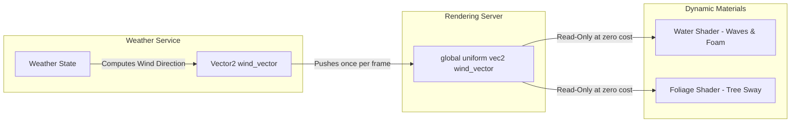
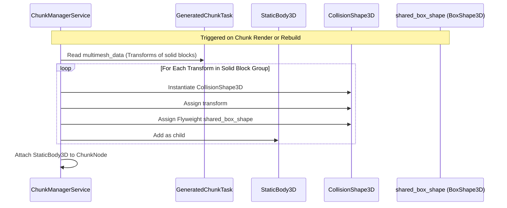
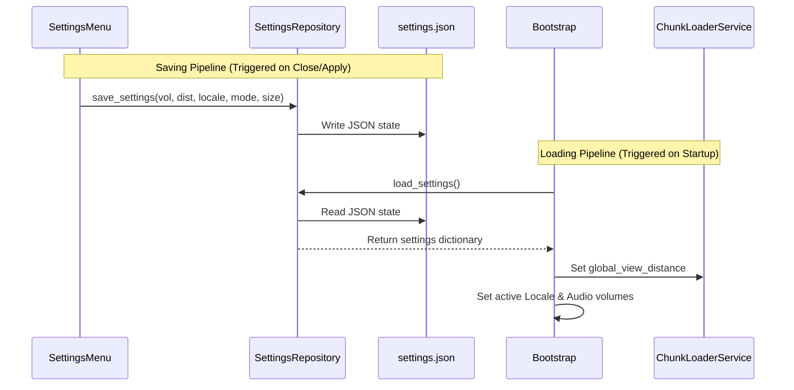
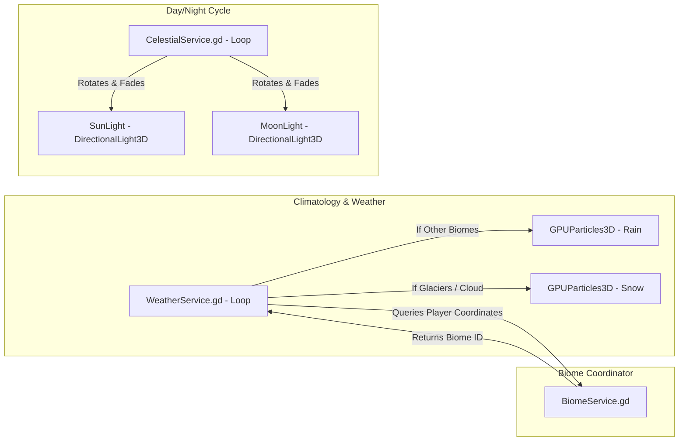

# CraftDomain

A high-performance, infinite procedural voxel sandbox game engine built in **Godot 4.6.3** adhering to **Domain-Driven Design (DDD)** principles and strict **SOLID** software engineering compliance. Architected to demonstrate highly decoupled, modular, and extensible systems capable of maintaining a locked **120 FPS** in massive environments.

---

## Architectural Philosophy: Domain-Driven Design (DDD)

CraftDomain is architected using **Domain-Driven Design (DDD)**. By segregating the codebase into distinct layers, we isolate pure business rules (the "Domain") from framework-specific engine details (the "Infrastructure"), such as Vulkan rendering, physics colliders, disk I/O, and audio buses.

### Layer Segmentation & Dependency Flow

```mermaid
graph TD
	subgraph Core_Bootstrap [Core / Bootstrap Layer]
		Bootstrap[Bootstrap.gd - Composition Root]
	end

	subgraph Infrastructure_Layer [Infrastructure Layer]
		WorldController[WorldController.gd]
		ChunkManager[ChunkManagerService.gd - Object Pooling]
		ChunkNode[ChunkNode.gd - MultiMesh]
		ChunkMesher[ChunkMesher.gd - SurfaceTool Normal Baker]
		PlayerController[PlayerController.gd - Physics]
		DiskWorldRepository[DiskWorldRepository.gd - JSON I/O]
		DialogueManager[DialogueManager.gd]
		WeatherService[WeatherService.gd - Particles]
		AudioService[AudioService.gd - Observer SFX]
	end

	subgraph Domain_Layer [Domain Layer]
		WorldState[WorldState.gd - Aggregate Root]
		Chunk[Chunk.gd - Voxel Grid]
		VoxelEntity[VoxelEntity.gd - Health & Combat]
		IBiome[IBiome.gd - Strategy Interface]
		IInventory[IInventory.gd - Interface Segregation]
		QuestService[QuestService.gd - Domain Quest State]
		DialogueService[DialogueService.gd - Dialogue Router]
		CraftingService[CraftingService.gd - Transaction Logic]
		IWorldModifier[IWorldModifier.gd - Adapter]
		VoxelNavigationService[VoxelNavigationService.gd - 3D AStar Graph]
		AlertNetworkService[AlertNetworkService.gd - Proximity Alarms]
		VillageReputationService[VillageReputationService.gd - Karma Engine]
		IAIBehavior[IAIBehavior.gd - AI Strategy Interface]
		IStructureBlueprint[IStructureBlueprint.gd - Map Strategy Interface]
	end

	Bootstrap -->|Injects Repositories & Controllers| WorldController
	Bootstrap -->|Registers| IBiome
	Bootstrap -->|Binds| IAIBehavior
	Bootstrap -->|Binds| IStructureBlueprint
	WorldController -->|Queries & Updates| WorldState
	WorldState -->|Contains| Chunk
	ChunkNode -->|Renders| Chunk
	ChunkNode -->|Calls| ChunkMesher
	PlayerController -->|Manipulates| IInventory
	DiskWorldRepository -->|Implements| WorldRepository
	DialogueManager -->|Queries| DialogueService
	CraftingService -->|Modifies| IInventory
```

1. **The Domain Layer (`src/Domain/`):** Contains the core business logic. It has zero dependencies on Godot's scene tree, physics servers, or rendering API. It consists of:
   * **Aggregates & Entities:** `WorldState.gd` (Aggregate Root managing chunks), `Chunk.gd` (Voxel Grid), `VoxelEntity.gd` (Logical health rules), and `Quest.gd` (Logical quest representation).
   * **Value Objects:** `BlockDefinition.gd` (Immutable block traits and procedural color definitions) and `Recipe.gd` (Encapsulates required inputs and output attributes for crafting).
   * **Domain Services:** `TradingService.gd` (Decoupled inventory transaction rules), `BiomeService.gd` (Dynamic biome routing), `StructureLibrary.gd` (Blueprint routing), `QuestService.gd` (Decoupled quest state coordinator), `VoxelNavigationService.gd` (3D A* graph network coordinator), `VillageReputationService.gd` (Player karma tracker), and `CraftingService.gd`.
   * **Interfaces & Strategies:** `IInventory.gd` (Segregated inventory contract supporting item-ID stacking queries), `IWorldModifier.gd` (World interaction bridge), `IAIBehavior.gd` (Polymorphic AI contract), and `IStructureBlueprint.gd` (Polymorphic landscaping contract).

2. **The Infrastructure Layer (`src/Infrastructure/`):** Concrete implementations of hardware-bound or framework-bound systems.
   * **Rendering & Materials (`src/Infrastructure/Rendering/`):** `ChunkNode.gd` segments rendering transforms into individual, block-type MultiMesh nodes, applying PBR materials and custom GPU shaders. `ChunkMesher.gd` manages the geometric extraction of liquid and non-cubic custom meshes. `ChunkManagerService.gd` controls multithreading and Node Object Pools.
   * **Physics & Interactions (`src/Infrastructure/Player/`):** First-person motion physics, camera rotation, head bobbing, and decoupled raycast interaction solvers.
   * **Persistence (`src/Infrastructure/Persistence/`):** `DiskWorldRepository.gd` implements JSON delta serialization inside Godot's safe `user://` directory, now supporting full 24-slot inventory status profiles. Uses `VoxelSaveSerializer.gd` to decouple serialization structures from raw I/O.
   * **Life & AI (`src/Infrastructure/Life/`):** Physics-bound passive and hostile AI, rendering programmatic 3D box-composition models, and scheduling pathfinding or shelter tasks.
   * **Audio (`src/Infrastructure/Audio/`):** `AudioService.gd` manages soundtrack crossfading and observer-driven 3D positional OGG sound effects.

3. **The Core/Bootstrap Layer (`src/Core/Bootstrap`):**
   * Acts as the **Composition Root**. It instantiates the required database repositories, configures environment nodes, registers biomes/structures, and injects loose dependencies during scene transitions, ensuring no circular compiler loops exist.

---

## SOLID Software Engineering Compliance

The architecture of CraftDomain is highly optimized to comply with the five SOLID software engineering design principles:

### 1. Single Responsibility Principle (SRP)
Each class has a single, strictly defined reason to change:
* **`WorldController.gd`:** Offloaded from physical and visual meshing calculations. It acts strictly as an asynchronous coordinator for chunk I/O and thread scheduling, delegating 3D matrix grouping to the stateless `ChunkVisualBuilder.gd` and threading limits to `ChunkManagerService.gd`.
* **`PlayerController.gd`:** Responsible *only* for movement physics, camera input handling, and velocity calculations. It delegates all raycasting, block mining, building, eating, and combat actions to `VoxelInteractionComponent.gd`.
* **`PlayerHUD.gd`:** Acts strictly as a lightweight orchestrator for the UI composition. It delegates specific layout configurations and real-time mathematical calculations to dedicated widgets: `MinimapWidget`, `GPSPanelWidget`, and `QuestTrackerWidget`.
* **`VoxelSaveSerializer.gd`:** Extracted from the repository to handle data formatting/parsing exclusively, leaving `DiskWorldRepository.gd` with the sole responsibility of disk I/O.
* **`InventorySlotWidget.gd`:** Extracted from the inventory overlay to isolate cell rendering and drag-and-drop mechanics from container orchestration.

### 2. Open-Closed Principle (OCP)
*Classes are open for extension, but closed for modification.*
CraftDomain utilizes data-driven registry, loading, and strategy patterns to ensure new content can be added without modifying existing code.

* **Data-Driven i18n Translations:** The engine dynamically loads translation data from `assets/translations/en.json` and `es.json`. Dialogue trees, item names, UI headers, and even floating speech bubbles are parsed using localization keys without hardcoding raw text in the controllers.
* **Data-Driven Block Properties:** `BlockType` physical properties (solidity, transparency) are determined dynamically by querying configurations registered inside `BlockLibrary.gd`'s static constructor, removing monolithic hardcoded `match` tables.
* **100% Compiled Procedural Blueprints:** Obsolete JSON structures and old parsing blueprints (`TemplateStructureBlueprint.gd`) have been completely replaced. Natural flora, retro warp pipes, mine pillars, and market cabins are now registered as OCP compiled strategy scripts (`IStructureBlueprint.gd`) executing directly in RAM at zero startup I/O cost.
* **Polymorphic Biome Territories:** Biome boundary divisions inside `BiomeService.gd` are decoupled from hardcoded mathematical angles. Concrete `IBiome` strategies determine their own coordinates polimorphically using `is_coordinate_inside()`.
* **Dynamic Streetlight Themes:** `StreetlightEntity.gd` is agnostic of specific biome styles. It queries the active biome strategy for a custom configuration dictionary (`get_streetlight_theme()`) to paint lights and poles dynamically.

### 3. Liskov Substitution Principle (LSP)
Subclasses must be substitutable for their base classes without altering program correctness:
* Any strategy implementing `IBiome` can be processed by `BiomeService` and evaluated by `WorldGenerator` without runtime exceptions.
* Any blueprint implementing `IStructureBlueprint` (such as `WarpPipeBlueprint.gd` or `AdaptiveMinePillarBlueprint.gd`) is processed dynamically inside the meshing threads without type mismatches.
* Passive and Hostile entities inherit from `PassiveEntity.gd` (`TurtleEntity`, `ElephantEntity`, `FoxEntity`), implementing their custom shapes and behaviors polimorphically while using the parent's base physics, blinking loops, variant seeding, and death sequences seamlessly.
* **Fauna Segregation:** The virtual contract `_has_ui_decorations()` restricts floating speech bubbles, quest arrows, and conversation states exclusively to humanoid civilians. Wild animals return `false` on this check, avoiding redundant UI overhead and complying cleanly with LSP.

### 4. Interface Segregation Principle (ISP)
*Clients should not be forced to depend upon interfaces they do not use.*
* Instead of passing the entire `PlayerController.gd` (which contains camera vectors, physics movement, and input states) to the trading, loot drop, or crafting systems, the game defines `IInventory.gd`.
* `TradingService`, `CraftingService`, and `PassiveEntity` (NPCs) interact *only* with the abstract `IInventory` interface, completely separating transaction logic from character movement and camera physics.
* **Strict Casting & Type Validation:** UI overlays and controllers (like `DialogueOverlay.gd` and `DialogueManager.gd`) execute safe runtime casting (`as DialogueNode`, `as DialogueChoice`, `as IInventory`) to query parameters, securing compile-time property validation and clearing untyped Variant warnings.

### 5. Dependency Inversion Principle (DIP)
*High-level modules must not depend on low-level modules; both must depend on abstractions.*
* `WorldController.gd` (High-level coordinator) never directly instantiates or imports `DiskWorldRepository.gd` (Low-level JSON file details). Instead, it holds a reference to the abstract class `WorldRepository`.
* `VoxelInteractionComponent.gd` interacts with the world grid via an injected `IWorldModifier` adapter, preventing the Domain from coupling with concrete Godot SceneTree nodes.
* **Decoupled AI Strategy Integration:** High-level entities inject their decision-making logic dynamically into `NPCAIComponent.gd` through the `IAIBehavior` strategy interface, completely decoupling NPC physics controllers from logical routines.
* **Parser Scoping Safety:** Static inner class adapters (like `WorldModifierAdapter` inside `WorldController.gd`) are placed at the very end of scripts, preventing GDScript's indentation-based C++ parser from capturing base-class helper methods into inner class scopes.

---

## High-Performance Voxel Sandbox Optimizations

Voxel sandbox games are traditionally notorious for CPU and GPU bottlenecks. CraftDomain implements custom lower-level optimizations to maintain rock-solid 120 FPS:

### 1. Hybrid Instant/Threaded Mesher (120 FPS Mining)
To prevent Main Thread stutters and lag when placing or breaking blocks, CraftDomain utilizes a dual-pipeline meshing system:
* The modified chunk is rebuilt synchronously on the Main Thread (`_rebuild_chunk_instantly`), completing in less than 0.5ms to provide instantaneous physical/visual feedback.
* Any adjacent boundary chunks affected by the edit are offloaded asynchronously as high-priority tasks to background thread workers via the `WorkerThreadPool` (`_request_chunk_rebuild`), preventing rendering freezes completely.

### 2. Time-Sliced Physics Budgeting & Object Pooling
* **Dynamic Throttling:** Background threads are capped strictly to 2 during teleports or startup, leaving CPU cores free for Vulkan shader compiles.
* **Physics Budgeting:** `ChunkManagerService` compiles a maximum of 1-2 heavy concave collision bodies per frame, spreading physics registration overhead evenly and guaranteeing zero frame drops.
* **Object Pooling:** Inactive chunks are stored in `_chunk_node_pool` and recycled dynamically instead of triggering expensive Garbage Collection `queue_free()` sweeps.

### 3. Decoupled AI Strategy Pattern & Throttling
* **Strategy Pattern AI (`IAIBehavior`):** Extracted specialized entity AI routines from physical scripts into distinct strategies (e.g. `GargoyleAIBehavior`, `GoblinAIBehavior`, `AmphibiousAIBehavior`, `MinerAIBehavior`, `CatAIBehavior`, `DruidAIBehavior`). Keeping physical entities strictly focused on translations while delegating logical decisions to the Domain.
* **LOD AI Tick Rate:** AI sensory sweeps, threat scans, and pathfinding calculations scale their update intervals dynamically based on distance to the player: Close Range (<15m) updates at 20Hz, Mid Range (15-35m) at 4Hz, and Far Range (>35m) at 0.5Hz, reducing village CPU overhead by over 95%.
* **Smooth Vector Continuation:** Walk-cycle vector interpolations and local obstacle-jumping are processed every frame on the physics thread, ensuring entities continue to slide smoothly on screen even during throttled frames.
* **$O(1)$ Targeting:** Active entities scan for targets by querying Godot's C++ native group registry (`"hostiles"` and `"passives"`), eliminating the performance spikes of old $O(N)$ child-scanning loops.

### 4. Compile-Free Unshaded Particles & Safe Shutdowns
* To prevent dynamic Vulkan pipeline compilations (which drop FPS down to single digits during block mining), mining debris has been migrated to `CPUParticles3D` using `SHADING_MODE_UNSHADED` materials. This runs entirely on the CPU at zero compile cost.
* **Memory-Safe Timers:** All temporary particle timers connect their `timeout` signals directly to `particles.queue_free` instead of compiling dynamic lambda captures, permanently preventing `Lambda capture at index 0 was freed` memory leaks upon world exit.

### 5. Global Wind Shader System
To synchronize environmental weather parameters (waves travelling with the wind, foliage leaves swaying along the wind line) across all shaders without incurring materials overhead, CraftDomain utilizes **Global Shader Uniforms**:

```mermaid
graph LR
	subgraph Weather_Simulation [Weather Service]
		Weather[Weather State] -->|Computes Wind Direction| CPU_Wind[Vector2 wind_vector]
	end

	subgraph GPU_Registers [Rendering Server]
		CPU_Wind -->|Pushes once per frame| Global_GPU_Uniform[global uniform vec2 wind_vector]
	end

	subgraph Shaders [Dynamic Materials]
		Global_GPU_Uniform -->|Read-Only at zero cost| Water_Shader[Water Shader - Waves & Foam]
		Global_GPU_Uniform -->|Read-Only at zero cost| Leaf_Shader[Foliage Shader - Tree Sway]
	end
```

### 6. Opaque Far-LOD Culling, Unified Meshing & Normal Baking
* **Alpha-Blend Bypass:** Distant chunks automatically switch translucent materials (Water, Glass, Clouds, Ice) to `TRANSPARENCY_DISABLED`. This bypasses expensive depth-sorting and alpha-blending passes on the GPU horizon, saving massive pixel fillrate overhead.
* **Sub-pixel Hermetic Sealing:** Transparent liquid and slab vertices are mathematically scaled outward from their center by a factor of `1.002` (2 millimeters). This tightly overlaps chunk borders, perfectly fixing all Z-fighting and sub-pixel light leaks.
* **Unified Mesh Baker (`ChunkMesher`):** Dispatches water, lava, and stone slab meshes inside a high-performance single-pass loop. Pre-bakes physical face normals (`generate_normals()`) on the CPU before committing buffers, securing proper PBR specularity and enabling precise vertex-wave displacement (`NORMAL.y > 0.5`) in GPU shaders.

### 7. Primitive Box Flyweight Collision Grid
Traditional `ConcavePolygonShape3D` meshes (triangle soups with zero volume) are prone to corner traps and seam-clinging bugs. `ChunkManagerService.gd` parses active solid transforms and constructs a grid of primitive solid `BoxShape3D` colliders using the **Flyweight Design Pattern**, sharing a single static instance across memory to resolve tunneling bugs natively.

```mermaid
sequenceDiagram
	participant CMS as ChunkManagerService
	participant Task as GeneratedChunkTask
	participant SB as StaticBody3D
	participant Col as CollisionShape3D
	participant BShape as shared_box_shape (BoxShape3D)

	Note over CMS,BShape: Triggered on Chunk Render or Rebuild
	CMS->>Task: Read multimesh_data (Transforms of solid blocks)
	loop For Each Transform in Solid Block Group
		CMS->>Col: Instantiate CollisionShape3D
		CMS->>Col: Assign transform
		CMS->>Col: Assign Flyweight shared_box_shape
		CMS->>SB: Add as child
	end
	CMS->>CMS: Attach StaticBody3D to ChunkNode
```

### 8. Expanded Horizon Draw Distance (162-Chunk Radius)
Through massive occlusion culling and background thread matrix compilation within `ChunkVisualBuilder.gd`, `ChunkLoaderService` pushes a **9x2x9 3D loading grid**. This active volume of **162 procedural chunks** quadruples the standard visual draw distance natively, allowing you to see mountain peaks and castles way in the distance while maintaining a locked 120 FPS.

### 9. Anisotropic PBR Terrain Rendering & Selective Beveling
* **Texture Filtering:** Configured to `BaseMaterial3D.TEXTURE_FILTER_NEAREST_WITH_MIPMAPS_ANISOTROPIC` to completely eliminate shimmering and Moiré noise artifacts on oblique flat surfaces (beaches, highways).
* **Selective Beveling:** Implements a procedural, mathematically perfect 64x64 Bevel Normal Map baked into RAM on startup. Applied selectively only to construction blocks (Bricks, Wood, Glass), leaving natural terrain flat and contiguous to prevent "waffle grid" patterns.

### 10. Voxel-Support Block Gravity for Props
Since interactive village props are spawned as lightweight `StaticBody3D` nodes to protect CPU cycles, they do not simulate physical gravity. Instead, the engine implements a block-support validation check when blocks are broken:
* **Shattering Destructibles:** Broken blocks supporting a Barrel, Chest, or Campfire cause the prop to shatter, spawning wood debris particles and dropping loot.
* **Procedural Sliding & Collapse:** Broken blocks supporting a heavy Wishing Well or Streetlight trigger a smooth, downward bouncing Tween to the next solid floor surface and play heavy stone thud landing sounds.

---

## Persistent Configuration Settings Pipeline

To persist system preferences (audio volumes, window properties, language, and render distance), the engine implements a dedicated saving/loading pipeline decoupled from world files. 

```mermaid
sequenceDiagram
	participant UI as SettingsMenu
	participant Repo as SettingsRepository
	participant Disk as settings.json
	participant Boot as Bootstrap
	participant Serv as ChunkLoaderService

	Note over UI,Disk: Saving Pipeline (Triggered on Close/Apply)
	UI->>Repo: save_settings(vol, dist, locale, mode, size)
	Repo->>Disk: Write JSON state
	
	Note over Boot,Serv: Loading Pipeline (Triggered on Startup)
	Boot->>Repo: load_settings()
	Repo->>Disk: Read JSON state
	Repo-->>Boot: Return settings dictionary
	Boot->>Serv: Set global_view_distance
	Boot->>Boot: Set active Locale & Audio volumes
```

By encapsulating I/O operations inside `SettingsRepository.gd`, UI components write to disk only during key events (such as pressing the back button or applying resolutions), protecting SSD/storage health from continuous drag-write loops.

---

## Dynamic Weather & Atmospheric Cycles

The world features an integrated celestial and climatological loop coordinating sun, moon, and weather states:

```mermaid
graph LR
	subgraph Weather_Engine [Climatology & Weather]
		WeatherService[WeatherService.gd - Loop]
		RainParticles[GPUParticles3D - Rain]
		SnowParticles[GPUParticles3D - Snow]
	end

	subgraph Celestial_Engine [Day/Night Cycle]
		CelestialService[CelestialService.gd - Loop]
		SunLight[SunLight - DirectionalLight3D]
		MoonLight[MoonLight - DirectionalLight3D]
	end

	subgraph Domain_Services [Biome Coordinator]
		BiomeService[BiomeService.gd]
	end

	CelestialService -->|Rotates & Fades| SunLight
	CelestialService -->|Rotates & Fades| MoonLight
	WeatherService -->|Queries Player Coordinates| BiomeService
	BiomeService -->|Returns Biome ID| WeatherService
	WeatherService -->|If Glaciers / Cloud| SnowParticles
	WeatherService -->|If Other Biomes| RainParticles
```

### 1. Deterministic Sky & Weather-Integrated Shader
The world features a custom GPU Sky Shader (`celestial_sky.gdshader`) integrated with the celestial clock:
* **True Celestial Orbits:** The Sun disk and Moon crescent are rendered on the sky dome using coordinates passed dynamically from `CelestialService.gd`.
* **Twinkling Starfield:** A procedural, rotating 3D starfield fades in at night and dims as dawn approaches.
* **Dynamic Weather Overcast:** The shader reads the `storm_weight` uniform. When rain/snow begins, the sky smoothly fades to a heavy slate-grey over 5 seconds. Flat ceiling clouds, generated seamlessly via 3-Octave **GPU Fractional Brownian Motion (FBM)**, automatically thicken and dim the celestial bodies to mimic heavy storms.

### 2. Regional Climatology
`WeatherService.gd` manages dynamic weather shifts (Sunny, Rainy, Snowy) that interact with regional biomes:
* **The Performance Emitter:** The particle system is positioned exactly above the player's head, ensuring it only rains/snows in their immediate vicinity, protecting GPU fillrate.
* **Dynamic Biome Detection:** If precipitation begins and the player is in `Frostbite Glaciers` or `Cloud Kingdom`, the system automatically alters the particle mesh to slowly drifting, wind-blown white snowflakes.

---

## Procedural World Generation & Regional Biomes

The world dynamically loads infinite terrain across 10 fully distinct environments, each boasting unique geographic rules, flora blueprints, and specialized NPC populations:

*   **Bay of Sails (Ocean):** Blue water expanses populated by aquatic Sea Turtles (`ID 201`). NPCs spawn in striped sailor outfits.
*   **Warp Plateau (Steps):** Vibrant green step-topography generating Warp Pipes and Giant Mario Mushrooms.
*   **Golden Bazaar (Plains):** Classical grasslands populated with Oak Trees (`ID 1`), Birch Trees (`ID 13`), Sakura Trees (`ID 10`), and beautiful flowering Rose Bushes (`ID 12`).
*   **Craggy Peaks & Caves:** Deep grey mountains and underground caverns illuminated dynamically by Cave Miners (`ID 105`) wearing active, sweeping 3D headlamp spotlight helmets.
*   **Frostbite Glaciers (Polo):** Freezing winter basin where NPCs spawn clothed in thick thermal fur hoods to withstand the snow.
*   **Whispering Redwood Forest:** Mossy canopies dominated by colossal 12-block high Redwood Trees. Inhabited by Forest Druids (`ID 104`) wielding longbows.
*   **Neon Ruins (Cyber Basin):** Obsidian and magenta stepped pyramids. Guarded by highly advanced Cyber Citizens (`ID 106`) with glowing circuitry.
*   **Red Sandstone Canyons:** Terraced badlands deserts decorated with twisted, woody Dead Shrubs (`ID 14`).
*   **Swamp of Sighs (Mist Bay):** Thick brown mud valleys populated by mysterious swamp alchemists in tattered cowls.
*   **Cloud Kingdom:** High-altitude floating white cloud islands supporting angelic inhabitants.

**Global Handcrafted Mega-Structures (3D Overhaul):**
Handcrafted architectural marvels spanning multiple chunks are placed dynamically at fixed coordinates, completely integrated with sloped-terrain blending:
*   **The Grand Castle `[200, 200]`:** A colossal two-story stone fortress featuring a majestic double-height Throne Hall, symmetrical rising double-wing staircases, private chambers (King/Queen suites), a high-security Royal Treasury, and crenellated rooftop battlements. Teleportation points are calibrated on the outer stone bridge.
*   **The Seaport & Galleon `[-150, 0]`:** A coastal port featuring wood-planked boardwalks, stacked cargo, a cozy two-story harbor tavern ("The Salty Sailor Inn"), and a moored three-deck Galleon Ship containing crew bunks, cargo hold, and a captain's cabin with glass popa windows.
*   **The Nether Fortress `[-300, -300]`:** A tattered volcanic brick citadel flanked by hot concentric lava canals and stone bridges, guarding a colossal double-height central Portal Sanctuary and a treasure pedestal.
*   **Steve's Settlement `[300, -300]`:** A playable village spanned by a giant mossy parabolic stone archway, central water fountain, irrigated wheat fields, a two-story log lodge, and a medieval windmill with fully accessible interior floors.
*   **Desert Oasis Pyramid `[-150, 250]`:** A stepped 10-tier sandstone pyramid built over water, housing a central pharaoh's sarcophagus altar, comfortable side stone stairs, and an elevated treasure vault under a glowing apex lighthouse.

---

## Decoupled SOLID UI Architecture

To satisfy the Single Responsibility Principle, the HUD is separated into modular, decoupled widgets managed under `PlayerHUD.gd`:

* **`MinimapWidget.gd`:** Renders the 2D circular radar, tracking the player arrow, regional biome colors, active markers, and 3D altitude chevrons (^ / v) for cave/climbing depth-sensing.
* **`GPSPanelWidget.gd`:** An elegant, localized overlay tracking coordinate grids, clock cycles, current biomes, and a procedural compass pointing directly toward the closest Global Mega-Structure.
* **`MapOverlay.gd`:** A fullscreen glassmorphic tactical world map enabling interactive dragging, panning, and OCP-compliant fast-travel teleportation. Transitions are smoothed using the dynamic cinematic `LoadingScreen.gd`.

### Commercial-Grade Responsive Design
* **100% Responsiveness:** Built strictly with `PanelContainer`, `MarginContainer`, and dynamic pivots. The UI automatically expands and centers itself regardless of screen resolution, aspect ratio, or translation length.
* **Tactile Glassmorphism:** Menus feature translucent panels, drop shadows, and physical 3D buttons that physically depress and scale on click using Godot's Tween engine.
* **Unified Center-Bottom Dock:** The 8 hotbar slots are grouped inside a sleek, glassmorphic bottom bar. The `🎒` (Backpack Inventory) and `🛠️` (Crafting Workshop) buttons are docked symmetrically.

---

## Inventory & Crafting Workshop Systems

### 1. Stack-Based Grid Inventory (`InventoryComponent.gd`)
The fixed inventory system has been refactored to support a fully dynamic **24-slot stackable grid**:
* **Grid Partitioning:** Slots 0 to 7 act as the active gameplay hotbar (synced to the HUD), while slots 8 to 23 form the extra 16-slot backpack storage (visible inside the Backpack screen).
* **Dynamic Stacking:** Items stack up to 64 units per slot, allowing multiple stacks of the same block types.
* **Sequential Swapping Engine:** Pressing `I` opens the glassmorphic Backpack menu. Clicking Slot A (glows in gold) and then Slot B swaps their contents physically. This allows seamless backpack sorting and hotbar rearranging.

### 2. Context-Aware Crafting Workshop (`CraftingOverlay.gd`)
Pressing `C` opens a dual-pane Blueprint Workshop overlay:
* **Blueprint Catalog (Left Pane):** Scrollable deck showing all available recipes parsed dynamically from `recipes.json`. Card margins are color-coded to match the output block types.
* **Visual Checklist (Right Pane):** Selecting a recipe displays its name, result count, and a color-coded checklist of required ingredients compared with the player's total inventory count (green if satisfied, red if missing).
* **Manufacturing Transaction:** Clicking the "Fabricate" button consumes the inputs globally across the grid, grants the crafted outcome, triggers a viewmodel hand-swing, and pops a sliding success notification.

---

## Advanced Procedural NPC AI & Rigging

The engine features highly reactive, modular, and procedurally generated non-player characters (NPCs) driven by decoupled `IAIBehavior` strategies:

*   **Observer-Driven Audio:** Mobs and events trigger 3D positional OGG sound effects via the `AudioService` (Service Locator pattern), keeping domain models completely decoupled from AudioStreamPlayers.
*   **Deterministic Aesthetic Variants:** NPCs derive their physical traits (skin tone, clothing color, hair color, and height scaling) mathematically from their spawning coordinates. No two villagers look alike, yet they remain consistent upon reloading.
*   **Conversational Gaze-Locks & Dynamic Dialogue:** When interacted with, NPCs freeze their patrol velocities and execute real-time geometric rotation slerps to lock eye contact with the player.
*   **17+ Decoupled AI Strategies:** Each humanoid and creature has its own isolated tactical behavior class:
	*   *Mummies/Zombies & Goblins:* Execute coordinated alarm networks and sneaky hit-and-run retreats after landing strikes.
	*   *Gothic Gargoyles:* Shift material state dynamically to solid grey stone by day, and awake to hover-sway and hunt players by night.
	*   *Sea Turtles & Beach Crabs:* Detect water blocks in real-time to glide with sinusoidal buoyancy, applying walking crawl speed penalties on sandy shores.
	*   *Village Protectors & Golems:* Sprint towards threats, draw weapon meshes, and execute 9.5-meter vertical launches.
	*   *Agricultural Farmers & Cave Miners:* Harvest golden crops, draw visual pickaxes to extract deep Coal Veins, and trigger unshaded break debris particles.
	*   *Forest Druids:* Meditate next to foliage and channel green éter particles to heal injured nearby animals.
	*   *Village Merchants & Cyber Citizens:* Run schedules to tend shops and count gold inside taverns by night, or walk paved roads executing 360-degree security scans.
	*   *Domestic Cats, Raccoons & Avians:* Purr next to campfires, actively scratch and break village loot barrels, or execute wide 3D thermal soar gliding rings to land/perch on tree leaves.
*   **Polymorphic Loot System:** Implementing the unified Death Engine, all creatures and NPCs trigger a physical shrinking animation accompanied by GPU smoke particles before deleting themselves and safely delegating specific drop tables.

---

## Controls Reference

* **`W`, `A`, `S`, `D` or Arrow Keys:** Move around.
* **Mouse Movement:** Look around (Smooth camera rotation processed inside `_unhandled_input` to match high-refresh monitor rates).
* **`Space`:** Jump.
* **`M`:** Open Fullscreen Tactical Map & Fast Travel.
* **`I` (or clicking the HUD 🎒 button):** Toggle the 24-slot Backpack Inventory & Inspector overlay.
* **`C` (or clicking the HUD 🛠️ button):** Toggle the Context-aware Crafting & Blueprint Workshop.
* **`Left Alt` (Hold):** Release the captured mouse cursor to click HUD shortcut buttons.
* **Mouse Scroll Wheel or Keys `1` to `8`:** Scroll through Hotbar slots.
* **Left-Click (or `E`):** Mine blocks (generating color-matched voxel debris particles) or swing the active weapon.
* **Right-Click (or `Q`):** Place blocks, plant seeds, consume items, or interact (Talking with villagers/guards/miners/wells).
* **`Escape`:** Unlocks mouse cursor, pauses game, and triggers a silent background auto-save.

---

## License

This project is licensed under the MIT License.
