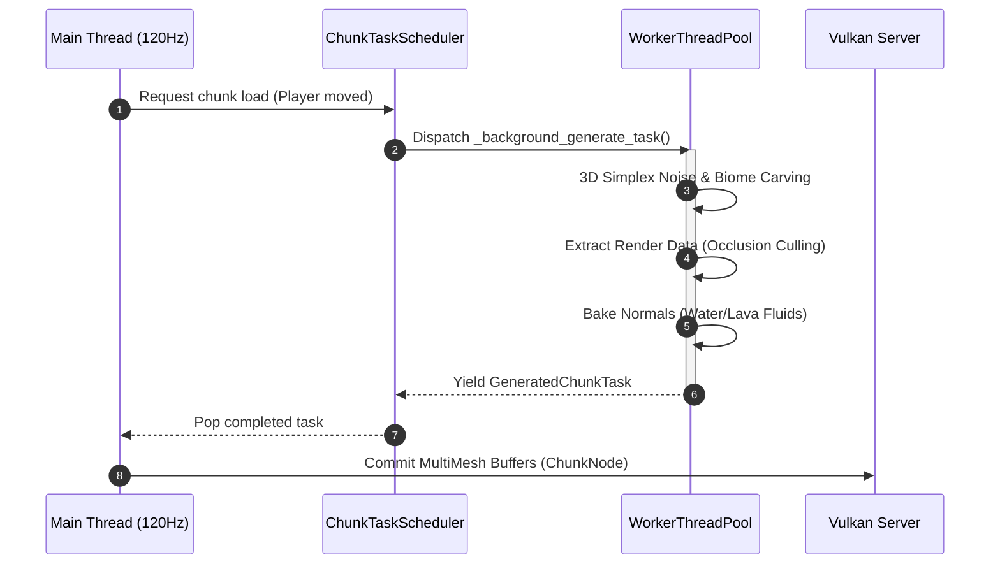
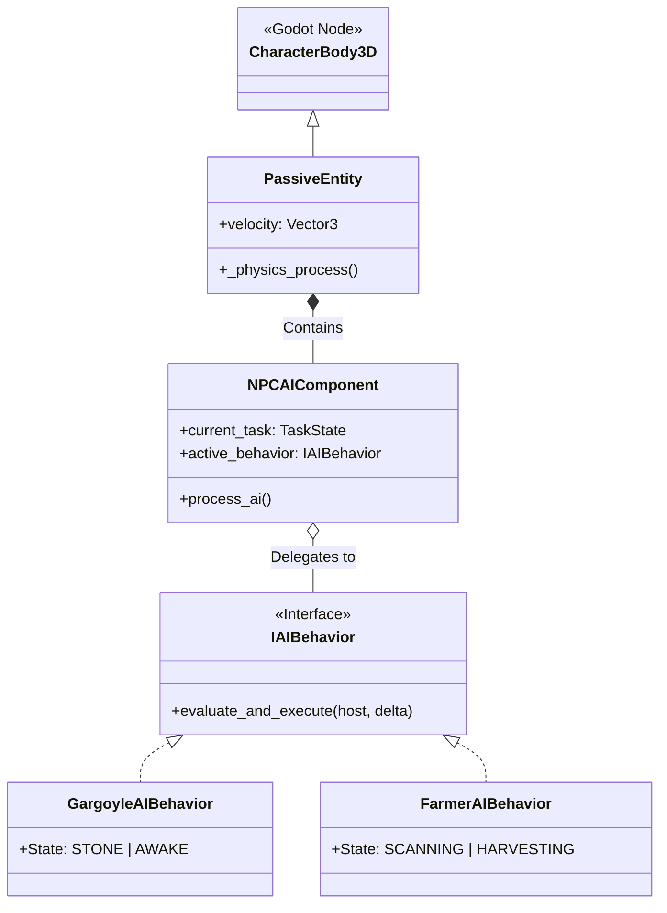

# CraftDomain (Codename: Dolores)

A high-performance, infinite procedural voxel sandbox game engine built in **Godot 4.6.3**. 

CraftDomain is engineered strictly under **Domain-Driven Design (DDD)** and **SOLID** software engineering principles. It serves as a masterclass in highly decoupled, modular, and extensible system architecture capable of maintaining a rock-solid **120 FPS** frame rate with smooth frame pacing in massive, thread-populated 3D environments.

---

## 🏗️ 1. Core Architectural Mandate (DDD)

We segregate the codebase into three distinct layers with a **strict one-way dependency flow**. Dependencies must only point inwards toward the Domain layer. 

```mermaid
graph TD
	subgraph Core_Layer ["Core (Composition Root)"]
		Bootstrap[Bootstrap.gd]
		Preloader[EntityPreloaderRegistry.gd]
	end

	subgraph Infra_Layer ["Infrastructure (Framework & I/O)"]
		WorldCtrl[WorldController.gd]
		PlayerCtrl[PlayerController.gd]
		DiskRepo[DiskWorldRepository.gd]
		NetSync[VoxelReplicator.gd]
	end

	subgraph Domain_Layer ["Domain (Pure Business Rules)"]
		WorldState[WorldState.gd]
		Entities[VoxelEntity.gd]
		Strategies[IAIBehavior / IStructureBlueprint]
		Interfaces[IWorldModifier / IInventory]
	end

	Core_Layer -->|Instantiates & Injects| Infra_Layer
	Infra_Layer -->|Implements & Uses| Domain_Layer
	Core_Layer -->|Registers| Domain_Layer
	
	style Domain_Layer fill:#1e293b,stroke:#00f3f3,stroke-width:2px
```

*   **The Domain Layer:** 100% agnostic of Godot's SceneTree. It contains pure data structures (`Chunk.gd`), mathematical solvers (`StructuralIntegritySolver.gd`), and logic boundaries. Inheriting from `Node` or accessing `RenderingServer` here is strictly prohibited.
*   **The Infrastructure Layer:** Manages Godot's visual representation, Vulkan rendering, ENet multiplayer sockets, and JSON disk saving.
*   **The Core Layer:** Acts as the Composition Root. It wires the dependencies together (e.g., injecting `DiskWorldRepository` into `WorldController`) and boots the application safely.

---

## ⚡ 2. High-Performance Voxel Pipeline (120 FPS Guardrail)

To prevent Main Thread stutters during infinite exploration or massive explosions, chunk generation and occlusion culling are offloaded to a dynamically budgeted `WorkerThreadPool`. 

```mermaid
sequenceDiagram
	autonumber
	participant Main as Main Thread (120Hz)
	participant Sched as ChunkTaskScheduler
	participant Pool as WorkerThreadPool
	participant GPU as Vulkan Server

	Main->>Sched: Request chunk load (Player moved)
	Sched->>Pool: Dispatch _background_generate_task()
	activate Pool
	Pool->>Pool: 3D Simplex Noise & Biome Carving
	Pool->>Pool: Extract Render Data (Occlusion Culling)
	Pool->>Pool: Bake Normals (Water/Lava Fluids)
	Pool-->>Sched: Yield GeneratedChunkTask
	deactivate Pool
	Sched-->>Main: Pop completed task
	Main->>GPU: Commit MultiMesh Buffers (ChunkNode)
```

*   **Universal LOD Decimation:** Distant chunks are automatically down-sampled from 16³ to 8x8x8 voxel geometry, slashing vertex shading overhead by 87.5% on mobile/integrated GPUs.
*   **Compile-Free Particles:** All mining debris uses `CPUParticles3D` with `SHADING_MODE_UNSHADED`. This prevents dynamic shader compilation stalls on the GPU during runtime.

---

## 🧠 3. Decoupled AI Strategy Pattern

Entities strictly separate their physical translations (Gravity, Wall sliding) from their logical decisions. AI "Brains" dynamically swap pure Domain strategy classes (`IAIBehavior`) at runtime without modifying the physical controllers.

```mermaid
classDiagram
	class CharacterBody3D {
		<<Godot Node>>
	}
	class PassiveEntity {
		+velocity: Vector3
		+_physics_process()
	}
	class NPCAIComponent {
		+current_task: TaskState
		+active_behavior: IAIBehavior
		+process_ai()
	}
	class IAIBehavior {
		<<Interface>>
		+evaluate_and_execute(host, delta)
	}
	class GargoyleAIBehavior {
		+State: STONE | AWAKE
	}
	class FarmerAIBehavior {
		+State: SCANNING | HARVESTING
	}

	CharacterBody3D <|-- PassiveEntity
	PassiveEntity *-- NPCAIComponent : Contains
	NPCAIComponent o-- IAIBehavior : Delegates to
	IAIBehavior <|.. GargoyleAIBehavior
	IAIBehavior <|.. FarmerAIBehavior
```

*   **Dynamic LOD AI Tick Rate:** Sensory sweeps (A* pathfinding, hostile targeting) scale based on player distance. Close range updates at 20Hz, mid-range at 4Hz, and far range drops to 0.5Hz, reducing CPU overhead by 95% in heavily populated areas.

---

## 🌐 4. Multiplayer & State Synchronization

CraftDomain supports P2P Multiplayer with Server-Authoritative Anti-Cheat validation and Late-Join Delta Synchronization. 

```mermaid
graph LR
	subgraph Server_Authority ["Host (Server Authority)"]
		SV_Rep[VoxelReplicator.gd]
		SV_AntiCheat[Distance Validation]
		SV_State[(WorldState Deltas)]
	end
	
	subgraph Remote_Client ["Remote Peer"]
		CL_Rep[VoxelReplicator.gd]
		CL_Action(Player places block)
	end
	
	subgraph Late_Joiner ["New Peer"]
		LJ_Rep[VoxelReplicator.gd]
	end

	CL_Action -- "rpc_id(1, block_id)" --> SV_AntiCheat
	SV_AntiCheat -- "Valid (Dist < 8m)" --> SV_Rep
	SV_AntiCheat -- "Invalid (Force Rubberband)" --> CL_Rep
	SV_Rep -- "rpc Broadcast (block_id)" --> CL_Rep
	SV_Rep --> SV_State
	
	SV_State -- "JSON Delta Stream on Join" --> LJ_Rep
	
	style Server_Authority fill:#1e293b,stroke:#ffaa00,stroke-width:2px
```

*   **Extrapolation & Rubberbanding:** `NetworkPlayerReplica.gd` uses linear extrapolation to predict movement during packet loss. If a client attempts to speedhack or reach too far, the server denies the RPC and issues a rubberband correction.
*   **Dual-Timeline Streaming:** When a new peer joins, the server serializes both `Past` and `Present` chunk modifications, sending a unified JSON payload to synchronize the newcomer instantly.

---

## 🛡️ 5. SOLID Compliance Checklist

*   **[S] Single Responsibility:** Controllers like `WorldController` only coordinate; they do not calculate geometry. `DiskWorldRepository` only streams files; it does not pack JSON data.
*   **[O] Open-Closed:** `BlockLibrary`, `MobRegistry`, and `StructureLibrary` dynamically load plugins/mods from `user://mods/` without modifying core engine scripts.
*   **[L] Liskov Substitution:** All structure blueprints (`IStructureBlueprint`) and biomes (`IBiome`) perfectly honor their interfaces. The engine can iterate through any of them safely.
*   **[I] Interface Segregation:** Services like `TradingService` and `CraftingService` rely strictly on `IInventory`, remaining entirely ignorant of `PlayerController` physics or camera vectors.
*   **[D] Dependency Inversion:** `PlayerController` places blocks via the abstract `IWorldModifier` interface, ensuring pure Domain systems never directly access Godot's `SceneTree`.

---

## ⌨️ 6. Controls Reference

| Action | PC (KBM) | Gamepad | Description |
| :--- | :---: | :---: | :--- |
| **Move** | `W/A/S/D` | `Left Stick` | Move character horizontally. |
| **Look** | `Mouse` | `Right Stick` | Rotate first-person camera. |
| **Jump / Glide** | `Space` | `A / Cross` | Jump or deploy Voxel Glider mid-air. |
| **Mine / Attack** | `Left-Click` | `R1 / RB` | Break blocks or swing active weapon. |
| **Place / Interact** | `Right-Click` | `L1 / LB` | Build blocks or talk to NPCs. |
| **Inventory** | `I` | `X / Square` | Open 24-slot Backpack & Inspector. |
| **Crafting** | `C` | `Y / Triangle` | Open Blueprint Workshop. |
| **Map** | `M` | `Back / Share` | Open Tactical World Map. |
| **Free Cursor** | `Hold L-Alt` | - | Releases captured mouse for UI clicking. |

---

## 📄 License

This project is licensed under the MIT License - see the [LICENSE](LICENSE) file for details.
