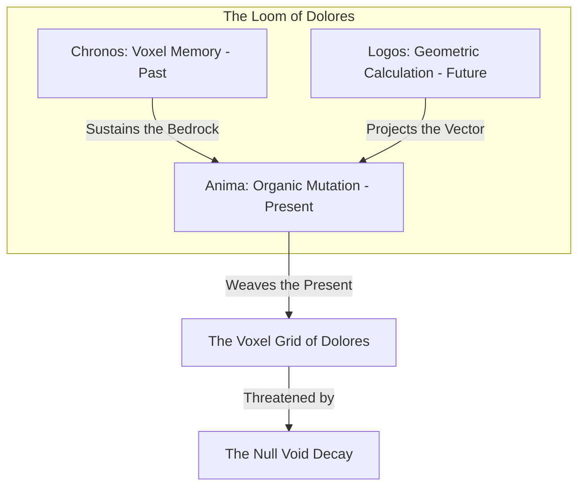

# CraftDomain - The Master Narrative Design, Mythology & Lore Bible of Dolores
*Developed by Enrique González Gutiérrez (enrique.gonzalez.gutierrez@gmail.com)*

This document serves as the absolute creative and mythological blueprint for the universe of **Dolores** (the codename of our simulation). It establishes a grand, emotionally rich, and mechanically unrestricted lore system. All future gameplay systems, asset pipelines, boss encounters, and world-building assets must align strictly with the creative vision compiled in this Master Bible.

---

## 🧭 I. THE COSMOLOGY OF DOLORES (THE LOOM OF THE GRID)

The universe of Dolores is not a physical land of stone and soil, but rather a living, breathing space-time tapestry known as **The Grid**. The world is continuously woven in real-time by a cosmic mechanism known as **The Chrono-Loom**, which balances the three fundamental elements of reality:



1.  **Chronos (The Past - The Anchor of Memory):** The energy that binds and preserves structural history. It manifests physically as the heavy Red Sandstone Canyons, where the voxel grid is dense, immutable, and rich with ancient terracotta structures that refuse to decay.
2.  **Anima (The Present - The Spark of Mutation):** The energy of change, growth, and organic free will. It manifests in the Golden Bazaar Plains, where crops grow, wind sways the leaves, and matter can be dynamically mined, reshaped, and built by living beings.
3.  **Logos (The Future - The Vector of Calculation):** The energy of cold optimization, geometric perfection, and mathematical finality. It manifests in the dark Neon Ruins, where organic biology is replaced by cold obsidian structures and glowing data-light pipelines.

---

## ☠️ II. THE NULL VOID CORRUPTION (THE GLITCH OUTBREAK)

The primary antagonist of the world is not merely a faction, but a cosmic anti-entropy force known as **The Null**. The Null is a corruption of space-time caused by the opening of **The Nether Breach**, an ancient gateway built by a rogue Weaver who sought to escape the cold, calculated certainty of the Future.

### 1. The Glitch Rifts
The Null does not simply destroy; it **unweaves** the voxel grid. Upon spilling into a chunk, it creates *Glitch Rifts*. These rifts physically fracture the terrain, causing blocks to lose their textures and dissolve into grey static noise, while some chunks lose their gravity vectors and float up into the sky as fragmented islands.

### 2. The Voxel Necrosis (The Husks)
When a living being is caught within a Glitch Rift, their code is corrupted. They become **Voxel Husks** (Zombies, Goblins, and Gargoyles). They are semi-petrified, hollow shells of grey stone covered in glowing violet glitches. They wander the nights with jerky, unnatural movements, seeking to "de-compile" the organic present and return it to the silence of the Null.

### 3. The Temporal Bleeding
The Null causes the eras to bleed into one another. In the middle of the lush green plains, the player might encounter a patch of ground that has glitched into ancient red sandstone (the Past) or cold, automated obsidian (the Future), creating a surreal, shifting landscape of temporal anomalies.

---

## 👥 III. THE CHARACTER PROFILES & EMOTIONAL ARCS

---

### 1. The Sailor (The Chrono-Nomad)
*   **Role:** The Player Character.
*   **Lore:** You are not a simple shipwrecked sailor. You are an entity from outside the Grid—a traveler whose ship was caught in a cosmic storm on the outer boundary of the simulation. Your arrival is a "construct glitch" in the system; because you do not belong to Dolores, your code is immune to the space-time decay of the Null.
*   **Emotional Arc:** You begin as a lost, terrified survivor desperately trying to rebuild your ship and escape. However, as you witness the tragic disintegration of Dolores and connect with its inhabitants, you accept your role as the Chrono-Nomad, choosing to sacrifice your chance of returning home to re-weave the world.

---

### 2. Maelor, the Last Weaver (Villager Elder)
*   **Role:** The Village Elder of the Golden Bazaar.
*   **Lore:** Maelor is actually the last surviving **Chrono-Weaver**, one of the ancient demigods who constructed the Chrono-Loom. He chose to live as a mortal villager to escape his past. Now, as the Null corruption spreads, his mind is literally fracturing. His memories are being overwritten by static noise, causing him to drift between lucidity and mantic madness.
*   **Psychology:** Paternal, deeply burdened, and tragic. He views the player with a mixture of hope and immense guilt, knowing that saving the world will require the player's permanent sacrifice.
*   **Speech Pattern:** Highly ceremonial, echoing, and ancient. He occasionally stops mid-sentence, muttering strings of binary coordinates as his thoughts glitch.
*   **Signature Line:** *"I remember the loom... *His eyes flicker with static* ...01001100. The threads were so bright, Nomad. Now they are fraying. You must hold the needle, even if the thread pierces your own soul."*

---

### 3. Valerius, the Rogue Alchemist (The Merchant)
*   **Role:** The eccentric Fryer Merchant.
*   **Lore:** Valerius is a rogue cyber-scientist from the Future era. He fled the Neon Ruins to find a cure for his young daughter, Lyra, who has been partially pixelated by the Null corruption. He stole the "Geothermal Fryer" technology because the high-frequency alchemical radiation of the heat slows down the pixelation process.
*   **The Emotional Stakes:** The silly "Fried Chicken" trade is actually a tragic cover! Valerius coats the chicken in specialized alchemical herbs and geothermal heat to feed his daughter, keeping her human code stable. He needs the player's lava buckets not for grease, but to keep his daughter alive!
*   **Psychology:** Desperate, brilliant, hiding his immense grief behind a mask of ruidous, eccentric salesmanship. He barters feverishly to gather the resources needed for his experiments.
*   **Speech Pattern:** High-speed, chaotic, switching from scientific jargon to bazaar-hawking. His eyes wide with a manic, desperate energy.
*   **Signature Line:** *"Lava! Yes, yes, the heat! *Wipes sweat from his brow* The thermal frequency must remain at 1200 Kelvin... for the chicken! Yes, the chicken! *Whispers desperately* ...She didn't wake up today, Nomad. Bring me the lava. Please."*

---

### 4. Aethelgard (The Sentinel Golem)
*   **Role:** The dormant giant in the plaza.
*   **Lore:** Aethelgard is not a brainless iron machine. It is a legendary war titan containing the soul of Maelor's fallen brother, who sacrificed his organic life to serve as the permanent anchor for the village's defense shield.
*   **Psychology:** Silent, protective, and sorrowful. It carries the weight of a thousand ancient battles.
*   **Speech Pattern:** Heavy stone grinding, low-frequency sub-bass hums, and steam vents.
*   **Signature Line:** `*Sub-bass Rumble*... I... SHIELD... THEE... *Steam Vent*... *CLANK*`

---

### 5. Malakor, the Weaver of Static (The Antagonist)
*   **Role:** The Rogue Chrono-Weaver / Main Villain.
*   **Lore:** Malakor was Maelor's co-creator. After gazing into the mathematically perfect Future calculated by the Obsidian Pyramid, he went mad, realizing that a perfect future ends in absolute cold stagnation and the death of free will. He opened the Nether Breach to let the Null destroy the world, believing that a chaotic, glitched end is far more beautiful than a cold, silent prison of perfect calculations.
*   **Psychology:** Nihilistic, charismatic, artistic, and deeply tragic. He views his destruction as an act of cosmic mercy.
*   **Speech Pattern:** Silky, elegant, mocking, but tinged with a profound sadness.
*   **Signature Line:** *"Look at them, Nomad. Paving roads, harvesting wheat, repeating the same simple cycles day after day. They want a future of perfect, silent columns. I am giving them freedom. I am giving them the beautiful chaos of the void."*

---

## 🎛️ VI. UNRESTRICTED MECHANICS TO IMPLEMENT IN THE FUTURE

To bring this narrative to life, we will implement the following high-end gameplay systems:

```text
1. Chrono-Scythe Weapon:
   - A weapon that physically cuts through Glitch Rifts, restoring the land's textures.
2. Voxel Glider:
   - Built of redwood planks and cloud fabric, letting the player glide across deep void chasms.
3. Time-Shift Rifts:
   - Portals that temporarily shift the active chunk back in time, letting the player cross a collapsed bridge by walking on its past, solid version.
4. Dynamic Defense Grid:
   - The ability to build barricades, tesla-coils, and traps in real-time during base-defense phases.
```
